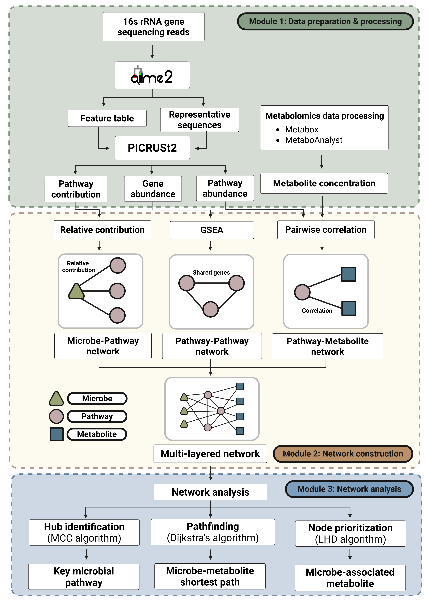
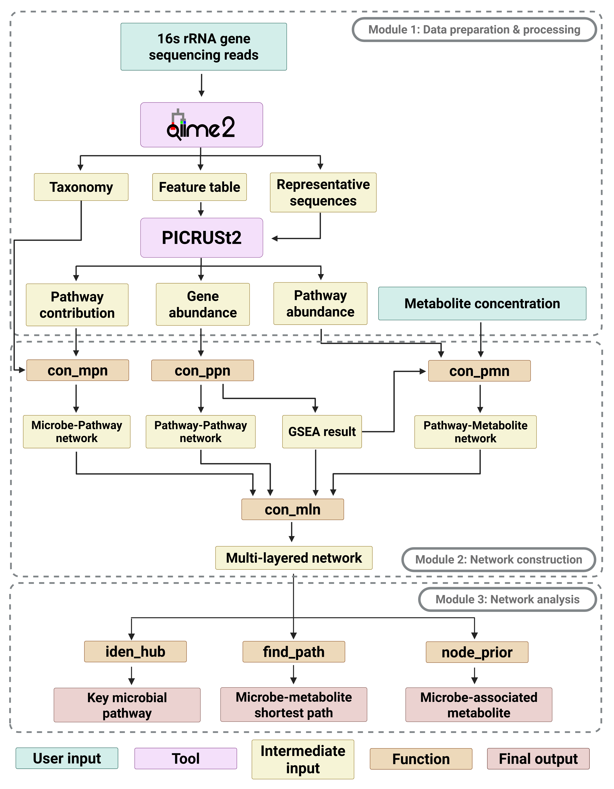

# NUIM: Network-based utility for integrating microbiome and metabolome data

We developed NUIM, a modular, network-based framework for integrating microbiome and metabolome data systematically. NUIM consists of three modules: (1) data preparation and processing, (2) network construction, and (3) network analysis. It provides a wide variety of network analyses to identify context-specific associations. These include hub identification, pathfinding, and node prioritization.

<p align="center">
  
</p>

## Required tools, R packages, and core functions for NUIM

The NUIM pipeline depends on a set of external bioinformatics tools and an R-based environment for network construction and analysis. The versions of these tools and packages may vary depending on the user. The following table details the requirements: 

| Category          | Tool / R package         |
| :---------------- | :----------------------- |
| **External tools**| `QIIME2` – for microbiome data processing. |
|                   | `PICRUSt2` – for functional prediction.     |
| **R packages**    | `dplyr` – for data manipulation.              |
|                   | `tidyr` – for data reshaping.                 |
|                   | `stats` – for statistical testing.            |
|                   | `tibble` – for tidy data frame support.       |
|                   | `stringr` – for string operations.            |
|                   | `tools` – for file and object manipulation.   |
|                   | `DESeq2` – for differential expression analysis. |
|                   | `clusterProfiler` – for GSEA analysis.                 | 
|                   | `igraph` – for handling network data and pathfinding analysis. |
|                   | `expm` – for matrix exponential in node prioritization analysis. | 
|                   | `ggplot2` – for data visualization.           |

#### **Core functions and their utilities**

The following table outlines the core functions of the NUIM pipeline and their primary utilities:

| Function | Utility |
| :---------------- | :----------------------- |
| `con_mpn` | Constructs microbe-pathway network. |
| `con_ppn` | Constructs pathway-pathway network. |
| `con_pmn` | Constructs pathway-metabolite network. |
| `con_mln` | Integrates individual networks into a multi-layered network. |
| `iden_hub` | Identifies key microbial pathways using MCC algorithm. |
| `find_path` | Identifies the shortest path between the selected source and target nodes using Dijkstra's algorithm. |
| `node_prior` |  Identifies microbe-associated metabolites using LHD algorithm. |

<p align="center">
  
</p>

**NOTE**: Run the function `read_input_file` in your R environment *once* before attempting to execute any other functions in the pipeline. This utility function is crucial, as it loads all input data files and supports both CSV and TSV formats.

```R
source("https://raw.githubusercontent.com/bowornpol/NUIM-pipeline/main/code/read_input_file.R")
```

## Module 1: Data preparation and processing

This module defines the procedures required to prepare and process the input data for downstream network construction.

- Input data includes `microbial sequencing reads in FASTQ format` and `metabolite concentration table`.  
- Microbiome data processing involves the use of QIIME2 to generate a feature table and representative sequences. These outputs are subsequently processed using PICRUSt2 for functional prediction, yielding gene abundance, pathway abundance, and pathway contribution data.  
- Although metabolome data processing may vary depending on user preference and experimental design, NUIM assumes that metabolite concentrations have been appropriately processed by standard practice. For example, users may employ established platforms such as [Metabox](https://metsysbio.com/tools_protocols/metabox-2-0) or [MetaboAnalyst](https://www.metaboanalyst.ca/MetaboAnalyst/docs/RTutorial.xhtml#2.2%20Data%20Processing%20and%20Statistical%20Analysis) to perform metabolomics data processing.

### <ins>QIIME2 workflow</ins>

This section provides a general QIIME2 workflow for processing paired-end 16S rRNA sequencing data.

#### **Required inputs**

| File            | Description                         |
|-----------------|-----------------------------------|
| `FASTQ`         | 16S rRNA gene sequencing reads. |
| `manifest.tsv`  | Mapping of sample IDs to FASTQ files. |  

<p align="center">
  
</p>

```bash
# Activate QIIME2 environment
conda activate qiime2

# STEP 1: Import paired-end FASTQ files using a manifest file
# The manifest CSV should map sample IDs to file paths of forward and reverse reads.

qiime tools import \
  --type 'SampleData[PairedEndSequencesWithQuality]' \
  --input-path manifest.csv \
  --input-format PairedEndFastqManifestPhred33 \
  --output-path demux_reads.qza

# STEP 2: Trim primers/adapters
# Replace the primer sequences below with the ones used in your sequencing protocol.

qiime cutadapt trim-paired \
  --i-demultiplexed-sequences demux_reads.qza \
  --p-front-f <forward_primer_sequence> \
  --p-front-r <reverse_primer_sequence> \
  --o-trimmed-sequences trimmed_reads.qza

# STEP 3: Summarize read quality
# Review this visualization to determine appropriate truncation lengths for the next step.

qiime demux summarize \
  --i-data trimmed_reads.qza \
  --o-visualization quality_summary.qzv

# STEP 4: Denoise reads using DADA2
# Use the quality summary from Step 3 to choose truncation lengths and other parameters.

qiime dada2 denoise-paired \
  --i-demultiplexed-seqs trimmed_reads.qza \
  --p-trunc-len-f <truncation_length_forward> \
  --p-trunc-len-r <truncation_length_reverse> \
  --o-table feature_table.qza \
  --o-representative-sequences rep_seqs.qza \
  --o-denoising-stats denoising_stats.qza

# STEP 5: Filter low-abundance features
# Adjust minimum sample count and read frequency as appropriate for your dataset.

qiime feature-table filter-features \
  --i-table feature_table.qza \
  --p-min-samples <minimum_number_of_samples> \
  --p-min-frequency <minimum_total_frequency> \
  --o-filtered-table filtered_table.qza

# STEP 6: Rarefy the table to a uniform sequencing depth
# Use rarefaction curves to help select the sampling depth.

qiime feature-table rarefy \
  --i-table filtered_table.qza \
  --p-sampling-depth <depth_to_rarefy> \
  --o-rarefied-table normalized_table.qza

# STEP 7: Taxonomic classification
# Use a pre-trained classifier appropriate for your 16S region (e.g., SILVA, Greengenes).

qiime feature-classifier classify-sklearn \
  --i-classifier <pretrained_classifier.qza> \
  --i-reads filtered_rep_seqs.qza \
  --o-classification taxonomy.qza

# STEP 8: Export data for PICRUSt2
# Export the final feature table and representative sequences for functional prediction.

qiime tools export \
  --input-path normalized_table.qza \
  --output-path feature-table

qiime tools export \
  --input-path rep_seqs.qza \
  --output-path rep_seqs

qiime tools export \
  --input-path taxonomy.qza \
  --output-path taxonomy
```

#### **QIIME2 outputs**

| File                | Description                      |
|---------------------|---------------------------------|
| `feature-table.biom` | Feature (ASV) count table. |
| `rep_seqs.fasta`    | Representative sequences. |
| `taxonomy.tsv`      | Taxonomic assignment of ASVs. | 

### <ins>PICRUSt2 workflow</ins>

PICRUSt2 predicts functional profiles from 16S rRNA data. This step uses a feature table and representative sequences from QIIME2.

#### **Required inputs**

| File                | Description                     |
|---------------------|---------------------------------|
| `feature-table.biom` | Feature table exported from QIIME2. |
| `rep_seqs.fasta`    | Representative sequences exported from QIIME2. |
| `pathway_gene_map.tsv` | Maps pathway IDs to their associated gene/KO IDs. **First column**: pathway IDs; **Other columns**: gene/KO IDs. |

<p align="center">
  
</p>

```bash
# Activate PICRUSt2 environment
conda activate picrust2

# Run PICRUSt2 pipeline (no NSTI filtering)
picrust2_pipeline.py \
  -s rep_seqs.fasta \
  -i feature-table.biom \
  -o picrust2_out

# Optional: Add --max_nsti to filter low-confidence ASVs
# e.g., --max_nsti 0.5

# Infer pathway abundance and pathway contribution
# Users can choose to use either KEGG or MetaCyc pathways

# Generate pathway abundance data (sample × pathway)
pathway_pipeline.py \
  -i KO_metagenome_out/pred_metagenome_unstrat.tsv.gz \
  -o pathway_abundance \
  --no_regroup \
  --map pathway_gene_map.tsv

# Generate pathway contribution data (ASV × pathway)
pathway_pipeline.py \
  -i KO_metagenome_out/pred_metagenome_unstrat.tsv.gz \
  -o pathway_contrib \
  --per_sequence_contrib \
  --per_sequence_abun KO_metagenome_out/seqtab_norm.tsv.gz \
  --per_sequence_function KO_predicted.tsv.gz \
  --no_regroup \
  --map pathway_gene_map.tsv

# Gene abundance data (KEGG Orthologs) output by PICRUSt2:
# Located in: KO_metagenome_out/pred_metagenome_unstrat.tsv.gz
# This file contains predicted gene family (KO) abundances per sample.
```

#### **PICRUSt2 outputs**

| File                      | Description                            |
|---------------------------|--------------------------------------|
| `pred_metagenome_unstrat.tsv` | Predicted gene abundance. |
| `path_abun_unstrat.tsv`   | Predicted pathway abundance. |
| `path_abun_contrib.tsv`   | Predicted pathway contribution. |

## Module 2: Network construction

This module constructs a tripartite network linking microbial taxa, functional pathways, and metabolites, based on the processed data from **Module 1**. Follow the steps below to construct each network layer using the provided R functions:

### <ins>STEP 1: Microbe–pathway network construction</ins>

The microbe–pathway network is constructed from pathway contribution data, with edges representing the relative contribution of each microbe to specific pathways.

#### **Required inputs**

| File                    | Description                                                                                                                                           | Required columns                               |
| :---------------------- | :---------------------------------------------------------------------------------------------------------------------------------------------------- | :--------------------------------------------- |
| `path_abun_contrib.tsv` | Pathway contribution data from PICRUSt2.                                                                                                              | `SampleID`, `FeatureID`, `FunctionID`, `taxon_function_abun` |
| `sample_metadata.*`   | Sample metadata. Required for group-specific analysis. If not provided or `class` column is missing, data will be processed as one 'overall' group. | `SampleID`, `class`                            |
| `taxonomy.tsv`          | Taxonomy annotations mapping `FeatureID` to taxonomic name (`TaxonID`) from QIIME2.                                                                               | `FeatureID`, `TaxonID`                         |

<details>
<summary>Click to show the full R function</summary>

```r
con_mpn <- function(
  contrib_file,
  metadata_file,
  taxonomy_file,
  output_file,
  file_type = c("csv", "tsv"),
  filtering = c("unfiltered", "mean", "median", "top10%", "top25%", "top50%", "top75%")
) {
  file_type <- match.arg(file_type)
  filtering <- match.arg(filtering)

  if (!dir.exists(output_file)) {
    dir.create(output_file, recursive = TRUE)
  }

  contrib <- tryCatch(
    read_input_file(contrib_file, file_type = file_type, stringsAsFactors = FALSE),
    error = function(e) stop(paste("Error loading contribution file: ", e$message))
  )
  metadata <- tryCatch(
    read_input_file(metadata_file, file_type = file_type, stringsAsFactors = FALSE),
    error = function(e) stop(paste("Error loading metadata file: ", e$message))
  )
  taxonomy <- tryCatch(
    read_input_file(taxonomy_file, file_type = file_type, stringsAsFactors = FALSE),
    error = function(e) stop(paste("Error loading taxonomy file: ", e$message))
  )

  if (!"class" %in% colnames(metadata)) {
    metadata$class <- "all"
  } else {
    metadata$class <- as.character(metadata$class)
  }

  contrib$SampleID <- as.character(contrib$SampleID)
  metadata$SampleID <- as.character(metadata$SampleID)
  contrib$FeatureID <- as.character(contrib$FeatureID)
  taxonomy$FeatureID <- as.character(taxonomy$FeatureID)
  contrib$FunctionID <- as.character(contrib$FunctionID)
  taxonomy$TaxonID <- as.character(taxonomy$TaxonID)

  merged <- merge(contrib, metadata, by = "SampleID", all.x = TRUE)
  if (nrow(merged) == 0) stop("Merging contribution and metadata resulted in an empty data frame.")

  cols_to_keep_from_taxonomy <- c("FeatureID", "TaxonID")
  if (!all(cols_to_keep_from_taxonomy %in% colnames(taxonomy))) {
    stop("Missing expected columns in taxonomy file: ", paste(setdiff(cols_to_keep_from_taxonomy, colnames(taxonomy)), collapse = ", "))
  }
  taxonomy_for_merge <- dplyr::select(taxonomy, dplyr::all_of(cols_to_keep_from_taxonomy))

  merged <- merge(merged, taxonomy_for_merge, by = "FeatureID", all.x = TRUE)
  if (!"taxon_function_abun" %in% colnames(merged)) {
    stop("Column 'taxon_function_abun' not found after merging.")
  }
  merged$taxon_function_abun <- as.numeric(merged$taxon_function_abun)

  unique_classes_clean <- unique(merged$class)
  unique_classes_clean <- unique_classes_clean[!is.na(unique_classes_clean)]

  if (length(unique_classes_clean) == 0) {
    warning("No valid (non-NA) classes found. Exiting.")
    return(character(0))
  }

  microbe_pathway_output_paths <- c()

  for (current_class in unique_classes_clean) {
    merged_class <- dplyr::filter(merged, class == current_class)
    if (nrow(merged_class) == 0) next

    taxon_function_total_class <- aggregate(
      taxon_function_abun ~ FunctionID + TaxonID,
      data = merged_class, sum, na.rm = TRUE
    )
    if (nrow(taxon_function_total_class) == 0) next

    function_total_class <- aggregate(
      taxon_function_abun ~ FunctionID,
      data = taxon_function_total_class, sum, na.rm = TRUE
    )
    colnames(function_total_class)[2] <- "total_abundance_all_taxa"
    taxon_function_total_class <- merge(taxon_function_total_class, function_total_class, by = "FunctionID")
    taxon_function_total_class$relative_contribution <- with(taxon_function_total_class,
                                                             ifelse(total_abundance_all_taxa == 0, 0, taxon_function_abun / total_abundance_all_taxa)
    )

    if (filtering != "unfiltered") {
      if (filtering %in% c("mean", "median")) {
        FUN_used <- if (filtering == "mean") mean else median
        threshold_df <- aggregate(relative_contribution ~ FunctionID,
                                  data = taxon_function_total_class,
                                  FUN = FUN_used, na.rm = TRUE)
        colnames(threshold_df)[2] <- "threshold"
        taxon_function_total_class <- merge(taxon_function_total_class, threshold_df, by = "FunctionID")
        taxon_function_total_class <- subset(taxon_function_total_class, relative_contribution >= threshold | is.na(threshold))
      } else {
        percent_map <- c("top10%" = 0.10, "top25%" = 0.25, "top50%" = 0.50, "top75%" = 0.75)
        taxon_function_total_class <- dplyr::ungroup(
          dplyr::filter(
            dplyr::mutate(
              dplyr::arrange(
                dplyr::group_by(taxon_function_total_class, FunctionID),
                dplyr::desc(relative_contribution)
              ),
              rank = dplyr::row_number(),
              n_taxa = dplyr::n(),
              cutoff = pmax(ceiling(percent_map[filtering] * dplyr::n()), 1)
            ),
            rank <= cutoff
          )
        )
        taxon_function_total_class <- dplyr::select(taxon_function_total_class, -rank, -n_taxa, -cutoff)
      }
      if (nrow(taxon_function_total_class) == 0) {
        next
      }
    }

    taxon_function_total_class <- taxon_function_total_class[
      order(taxon_function_total_class$FunctionID, -taxon_function_total_class$relative_contribution),
    ]
    file_suffix <- gsub("%", "", filtering)
    full_output_path <- file.path(output_file, paste0("microbe_pathway_network_", current_class, "_", file_suffix, ".csv"))
    write.csv(taxon_function_total_class, full_output_path, row.names = FALSE)
    microbe_pathway_output_paths <- c(microbe_pathway_output_paths, full_output_path)
  }

  return(microbe_pathway_output_paths)
}
```
</details> 

#### **Example usage**

```r
source("https://raw.githubusercontent.com/bowornpol/NUIM-pipeline/main/code/con_mpn.R")

# Define placeholder file paths and an output directory
# Replace these with your actual file paths and desired output location
contrib_file_path <- "data/path_abun_contrib.tsv"
metadata_file_path <- "data/sample_metadata.csv"
taxonomy_file_path <- "data/taxonomy.tsv"
output_directory_mpn <- "microbe_pathway_network_results"

con_mpn(
  contrib_file = contrib_file_path,
  metadata_file = metadata_file_path,
  taxonomy_file = taxonomy_file_path,
  output_file = output_directory_mpn,
  filtering = "median" # Filtering method: "unfiltered", "mean", "median", "top10%", "top25%", "top50%", "top75%"
)
```

#### **Example output**

The function generates a directory (e.g., `microbe_pathway_network_results`), which contains output files specific to the group analyzed and the filtering method applied (e.g., `microbe_pathway_network_[class]_[filtering].csv`).

**Example table: `microbe_pathway_network_G2_median.csv`**

| FunctionID | TaxonID            | taxon_function_abun | total_abundance_all_taxa | relative_contribution | threshold |
|:-----------|:-------------------|:----------------|:-------------------------|:----------------------|:--------------------|
| ko00365    | g__Bilophila       | 44.5            | 44.5                     | 1.0                   | 1.0                 |
| ko00571    | g__Bifidobacterium | 1073.7          | 1076.3                   | 0.97                 | 0.5                 |
| ko00720    | g__Blautia         | 14084.3         | 16493.0                  | 0.85                 | 0.05              |
| ...        | ...                | ...             | ...                      | ...                   | ...                 |

Each row represents a weighted edge linking a microbial taxon (`TaxonID`) to a functional pathway (`FunctionID`) with the strength of the edge defined by the `relative_contribution`.
- `taxon_function_abun`: The absolute contribution of a given taxon to a pathway summed across all samples for the specific class.
- `total_abundance_all_taxa`: The total combined contribution of all taxa to the same pathway, used as a baseline for normalization.
- `relative_contribution`: This column quantifies the proportional contribution of a specific microbial taxon to a given functional pathway.
- `threshold` (and other thresholds like mean or top%) are shown in the table to indicate the filtering cutoff used for each pathway. This helps explain which taxa passed the filtering based on their relative contribution.

### <ins>STEP 2: Pathway–pathway network construction</ins>

The pathway–pathway network is constructed using pathways identified as significant through Gene Set Enrichment Analysis (GSEA). Edges between pathways are defined based on shared genes, and Jaccard indices represent edge weights.

#### **Required inputs**

| File                        | Description                                                                 | Required Columns                                           |
| :-------------------------- | :-------------------------------------------------------------------------- | :--------------------------------------------------------- |
| `pred_metagenome_unstrat.tsv` | Gene abundance data from PICRUSt2.                                          | **Rows**: gene/KO IDs (first column, will become row names). **Columns**: Sample IDs (as column headers) |
| `sample_metadata.*`       | Sample metadata with group or condition information.                        | `SampleID`, `class`                                        |
| `pathway_gene_map.tsv`      | Maps pathway IDs to their associated gene/KO IDs.                           | **First column**: pathway IDs; **Other columns**: gene/KO IDs |

<details>
<summary>Click to show the full R function</summary>

```r
con_ppn <- function(
  abundance_file,
  metadata_file,
  map_file,
  output_file,
  file_type = c("csv", "tsv"),
  pvalueCutoff,
  pAdjustMethod = c("fdr", "holm", "hochberg", "hommel", "bonferroni", "BH", "BY", "none"),
  rank_by = c("signed_log_pvalue", "log2FoldChange")
) {
  # Validate inputs
  file_type <- match.arg(file_type)
  pAdjustMethod <- match.arg(pAdjustMethod)
  rank_by <- match.arg(rank_by)

  # Create output directory if it doesn't exist
  if (!dir.exists(output_file)) {
    dir.create(output_file, recursive = TRUE)
  }

  # 1. Load abundance data from provided file
  gene_abundance <- tryCatch(
    read_input_file(abundance_file, file_type = file_type, header = TRUE, row.names = 1, stringsAsFactors = FALSE),
    error = function(e) {
      stop(paste("Error loading abundance file '", abundance_file, "': ", e$message, sep = ""))
    }
  )

  # 2. Load sample metadata
  metadata <- tryCatch(
    read_input_file(metadata_file, file_type = file_type, header = TRUE, stringsAsFactors = FALSE),
    error = function(e) {
      stop(paste("Error loading metadata file '", metadata_file, "': ", e$message, sep = ""))
    }
  )

  # Ensure the correct SampleID and class columns are present
  if (!"SampleID" %in% colnames(metadata)) {
    stop("The 'sample_metadata.csv' file must contain a 'SampleID' column.")
  }
  if (!"class" %in% colnames(metadata)) {
    stop("The 'sample_metadata.csv' file must contain a 'class' column for group definition.")
  }

  # 3. Filter metadata samples present in abundance data
  sample_ids <- colnames(gene_abundance)
  metadata <- dplyr::filter(metadata, SampleID %in% sample_ids)

  # 4. Set 'condition' factor from 'class' column
  metadata$condition <- as.factor(metadata$class)
  rownames(metadata) <- metadata$SampleID #

  # 5. Round abundance counts for DESeq2 compatibility and ensure sample order
  gene_abundance_rounded <- round(gene_abundance)
  gene_abundance_rounded <- gene_abundance_rounded[, rownames(metadata), drop = FALSE] # drop=FALSE to handle single sample case

  # 6. Create DESeq2 dataset and run differential expression analysis
  dds <- tryCatch(
    DESeq2::DESeqDataSetFromMatrix(countData = gene_abundance_rounded,
                                   colData = metadata,
                                   design = ~ condition),
    error = function(e) {
      stop(paste("Error creating DESeq2 dataset: ", e$message, ". Check abundance data (must be integers) and metadata consistency.", sep = ""))
    }
  )

  dds <- tryCatch(
    DESeq2::DESeq(dds),
    error = function(e) {
      stop(paste("Error running DESeq2 analysis: ", e$message, ". This might happen if groups have zero variance, or too few samples.", sep = ""))
    }
  )

  # 7. Get all pairwise condition comparisons
  conditions <- levels(metadata$condition)
  if (length(conditions) < 2) {
    stop("Less than two unique conditions found in metadata 'class' column. Cannot perform pairwise comparisons.")
  }
  comparisons <- combn(conditions, 2, simplify = FALSE)

  # 8. Load pathway-to-gene mapping and reshape into TERM2GENE format
  map_raw <- tryCatch(
    read_input_file(map_file, file_type = file_type, header = FALSE, fill = TRUE, stringsAsFactors = FALSE, skip = 1),
    error = function(e) {
      stop(paste("Error loading map file '", map_file, "': ", e$message, ". Ensure it's a valid CSV/TSV.", sep = ""))
    }
  )

  TERM2GENE <- dplyr::distinct(
    dplyr::filter(
      dplyr::select(
        tidyr::gather(map_raw, key = "temp_col", value = "gene", -V1),
        term = V1, gene
      ),
      gene != ""
    )
  )

  if (nrow(TERM2GENE) == 0) {
    stop("No valid pathway-gene mappings found after processing '", map_file, "'. Check file format.")
  }

  gsea_results_list <- list()
  gsea_output_paths <- c() # Initialize vector to store GSEA paths
  jaccard_output_paths <- c() # Initialize vector to store Jaccard paths

  # 9. Loop over each pairwise comparison to run GSEA
  for (i in seq_along(comparisons)) {
    comp <- comparisons[[i]]
    cond1 <- comp[1]
    cond2 <- comp[2]
    comparison_name <- paste0(cond1, "_vs_", cond2)

    # Get DESeq2 results for contrast cond2 vs cond1
    res <- DESeq2::results(dds, contrast = c("condition", cond2, cond1))

    # Prepare ranked gene list
    ranked_df <- as.data.frame(res[, c("log2FoldChange", "pvalue")])
    # Filter out NA values for relevant columns before ranking
    ranked_df <- ranked_df[!is.na(ranked_df$log2FoldChange) & !is.na(ranked_df$pvalue), ]

    if (nrow(ranked_df) == 0) {
      warning("No valid log2FoldChange or pvalue for comparison ", comparison_name, ". Skipping GSEA.")
      next
    }

    # Apply chosen ranking method
    if (rank_by == "signed_log_pvalue") {
      # Handle cases where pvalue might be 0, leading to -log10(0) = Inf
      min_pvalue_for_log <- min(ranked_df$pvalue[ranked_df$pvalue > 0], na.rm = TRUE) / 2
      ranked_df$pvalue[ranked_df$pvalue == 0] <- min_pvalue_for_log
      ranked_df$rank <- sign(ranked_df$log2FoldChange) * -log10(ranked_df$pvalue)
    } else if (rank_by == "log2FoldChange") {
      ranked_df$rank <- ranked_df$log2FoldChange
    }

    ranked_df <- ranked_df[order(ranked_df$rank, decreasing = TRUE), ]
    geneList <- setNames(ranked_df$rank, rownames(ranked_df))

    # Run GSEA using clusterProfiler
    gsea_res <- tryCatch(
      clusterProfiler::GSEA(geneList = geneList,
                            TERM2GENE = TERM2GENE,
                            pvalueCutoff = pvalueCutoff,
                            pAdjustMethod = pAdjustMethod,
                            seed = TRUE,
                            verbose = FALSE),
      error = function(e) {
        warning(paste("GSEA failed for comparison ", comparison_name, ": ", e$message, ". Skipping.", sep = ""))
        return(NULL)
      }
    )

    if (is.null(gsea_res) || nrow(as.data.frame(gsea_res)) == 0) {
      next
    }

    # Save GSEA results dataframe
    gsea_df <- as.data.frame(gsea_res)
    key <- comparison_name
    gsea_results_list[[key]] <- gsea_df

    # --- Construct full output path for GSEA results with parameters ---

    # Format parameters for filename
    pvalueCutoff_fname <- as.character(pvalueCutoff)
    pAdjustMethod_fname <- pAdjustMethod
    rank_by_fname <- rank_by

    gsea_output_filename <- paste0(
      "gsea_results_", key, "_",
      pvalueCutoff_fname, "_",
      pAdjustMethod_fname, "_",
      rank_by_fname,
      ".csv"
    )

    gsea_output_path <- file.path(output_file, gsea_output_filename)
    write.csv(gsea_df, gsea_output_path, row.names = FALSE)
    gsea_output_paths <- c(gsea_output_paths, gsea_output_path) 
  }

  # 10. Compute Jaccard indices between pathways within each comparison's GSEA results
  jaccard_results_list <- list()

  if (length(gsea_results_list) == 0) {
    # No GSEA results to compute Jaccard indices. Skipping.
  } else {
    for (key in names(gsea_results_list)) {
      gsea_df <- gsea_results_list[[key]]

      # Filter for pathways with core enrichment genes (i.e., not empty or NA)
      gsea_df_filtered <- dplyr::filter(gsea_df, !is.na(core_enrichment) & core_enrichment != "")
      gene_sets <- strsplit(as.character(gsea_df_filtered$core_enrichment), "/")
      gene_sets <- lapply(gene_sets, function(x) unique(na.omit(x)))

      n <- length(gene_sets)
      res_list <- list()

      if (n < 2) { # Ensure there are at least two pathways to compare
        next
      }

      for (i in 1:(n - 1)) {
        for (j in (i + 1):n) {
          genes_i <- gene_sets[[i]]
          genes_j <- gene_sets[[j]]

          # Skip if either gene set is empty
          if (length(genes_i) == 0 || length(genes_j) == 0) {
            next
          }

          intersection <- length(intersect(genes_i, genes_j))
          union <- length(union(genes_i, genes_j))
          jaccard <- ifelse(union == 0, 0, intersection / union)

          if (jaccard > 0) {
            res_list[[length(res_list) + 1]] <- data.frame(
              FunctionID_1 = gsea_df_filtered$ID[i],
              FunctionID_2 = gsea_df_filtered$ID[j],
              jaccard_index = jaccard,
              comparison = key,
              stringsAsFactors = FALSE
            )
          }
        }
      }

      if (length(res_list) > 0) {
        jaccard_df <- do.call(rbind, res_list)
        # Construct full output path for Jaccard results using the new format
        jaccard_output_path <- file.path(output_file, paste0("pathway_pathway_network_from_gsea_", key, ".csv"))
        write.csv(jaccard_df, jaccard_output_path, row.names = FALSE)
        jaccard_output_paths <- c(jaccard_output_paths, jaccard_output_path) 
      } else {
        # No Jaccard indices > 0 found for comparison. Skipping saving file.
      }
    }
  }

  return(list(gsea_paths = gsea_output_paths, jaccard_paths = jaccard_output_paths)) 
}
```

</details>

#### **Example usage**

```r
source("https://raw.githubusercontent.com/bowornpol/NUIM-pipeline/main/code/con_ppn.R")

# Define placeholder file paths and an output directory
# Replace these with your actual file paths and desired output location
abundance_file_path <- "data/pred_metagenome_unstrat.tsv" 
metadata_file_path <- "data/sample_metadata.csv" 
map_file_path <- "data/pathway_gene_map.tsv" 
output_directory_ppn <- "pathway_pathway_network_results"

con_ppn(
  abundance_file = abundance_file_path, 
  metadata_file = metadata_file_path,   
  map_file = map_file_path,
  output_file = output_directory_ppn,
  pvalueCutoff = 0.05, # Adjusted p-value cutoff for GSEA
  pAdjustMethod = "BH", # P-value adjustment method: "fdr", "holm", "hochberg", "hommel", "bonferroni", "BH", "BY", "none"
  rank_by = "signed_log_pvalue" # How to rank genes: "signed_log_pvalue" or "log2FoldChange"
)
```

#### **Example output**

The function creates an output directory (e.g., `pathway_pathway_network_results`) containing `.csv` files for each pairwise group comparison (e.g., `G1_vs_G2`).

For each comparison, two types of files are generated:

1.  **`gsea_results_[class]_vs_[class]_[pvalueCutoff]_[pAdjustMethod]_[rank_by].csv`**: Contains detailed Gene Set Enrichment Analysis (GSEA) results for pathways. Each row describes an enriched pathway, including its ID, description, enrichment score (NES), and adjusted p-value (`p.adjust`). The `core_enrichment` column lists the key genes driving the enrichment.

2.  **`pathway_pathway_network_from_gsea_[class]_vs_[class].csv`**: Quantifies the similarity between *significant* pathways based on shared "core enriched" genes using the Jaccard index. This table defines the edges of the pathway-pathway network.

**Example table: `pathway_pathway_network_from_gsea_G1_vs_G2.csv`**

| FunctionID_1 | FunctionID_2 | jaccard_index | comparison |
|:----------|:----------|:--------------|:-----------|
| ko00500    | ko00230    | 0.021         | G1_vs_G2   |
| ko00500    | ko00030    | 0.035         | G1_vs_G2   |
| ko00500    | ko00052    | 0.083         | G1_vs_G2   |
| ko00550    | ko00470    | 0.064         | G1_vs_G2   |
| ...        | ...        | ...           | ...        |

Each row represents a connection between two pathways (`FunctionID_1`, `FunctionID_2`). 
- `jaccard_index`: A value from 0 to 1 indicating the degree of shared genes between the two pathways; a higher value means more overlap and a stronger functional relationship.
- `comparison`: Specifies the pairwise group comparison for which this Jaccard index was calculated. 

### <ins>STEP 3: Pathway–metabolite network construction</ins>

The pathway–metabolite network is constructed by calculating pairwise correlation (e.g., Spearman or Pearson) between pathway abundance and metabolite concentrations.  

#### **Required inputs**

| File                           | Description                                                                                                                                                        | Required columns                             |
| :-----------------------------| :------------------------------------------------------------------------------------------------------------------------------------------------------------------ | :-------------------------------------------- |
| `path_abun_unstrat.tsv`       | Pathway abundance data. Values will be converted to relative abundance within the function.                                                                        | **Rows**: Pathway/Function IDs (first column, will become row names). **Columns**: Sample IDs (as column headers) |
| `metabolite_concentration.*`| Metabolite concentration data.                                                                                                                                     | `SampleID`, Metabolite names (as columns)     |
| `sample_metadata.*`         | Sample metadata with group or condition information. If not provided or `class` column is missing, correlations will be performed on the overall dataset. | `SampleID`, `class`                           |
| `gsea_results_*.csv`          | GSEA results containing identified pathways.                                                                                                                       | `ID` (Pathway ID)                             |

<details>
<summary>Click to show the full R function</summary>

```r
con_pmn <- function(
  pathway_abundance_file,
  metabolite_concentration_file,
  gsea_results_file,
  metadata_file,
  output_file,
  file_type = c("csv", "tsv"),
  correlation_method = c("spearman", "pearson"),
  filter_by = c("none", "p_value", "q_value"),
  corr_cutoff,
  p_value_cutoff,
  q_value_cutoff,
  q_adjust_method = c("bonferroni", "fdr")
) {
  # Validate inputs
  file_type <- match.arg(file_type)
  correlation_method <- match.arg(correlation_method)
  filter_by <- match.arg(filter_by)
  q_adjust_method <- match.arg(q_adjust_method)

  if (filter_by == "p_value" && is.null(p_value_cutoff)) {
    stop("Error: 'p_value_cutoff' must be specified if 'filter_by' is 'p_value'.")
  }
  if (filter_by == "q_value" && is.null(q_value_cutoff)) {
    stop("Error: 'q_value_cutoff' must be specified if 'filter_by' is 'q_value'.")
  }

  # Create output directory if it doesn't exist
  if (!dir.exists(output_file)) {
    dir.create(output_file, recursive = TRUE)
  }

  # Determine gsea_suffix for filename and group processing priority
  gsea_suffix <- NULL 
  gsea_target_group_from_filename <- NULL
  gsea_source_group <- NULL 
  gsea_comparison_group_for_filename <- NULL 

  if (!is.null(gsea_results_file)) {
    # Check if the GSEA file exists before trying to read its name
    if (file.exists(gsea_results_file)) {
      gsea_basename <- tools::file_path_sans_ext(basename(gsea_results_file))

      # Account for additional parameters after the group names
      match_result <- stringr::str_match(gsea_basename, "^gsea_results_([^_]+)_vs_([^_]+).*$")

      if (!is.na(match_result[1,1])) { # If the full pattern matches successfully
        gsea_source_group <- match_result[1,2] 
        gsea_target_group_from_filename <- match_result[1,3] 
        gsea_comparison_group_for_filename <- paste0(gsea_source_group, "_vs_", gsea_target_group_from_filename) 
        gsea_suffix <- gsea_target_group_from_filename # gsea_suffix now holds the target group
      }
    }
  }

  # 1. Load data
  # Load Pathway Abundance (Expected: Pathways as Rows, Samples as Columns)
  pathway_abun_absolute <- tryCatch(
    read_input_file(pathway_abundance_file, file_type = file_type, header = TRUE, row.names = 1, stringsAsFactors = FALSE),
    error = function(e) {
      stop(paste("Error loading pathway abundance file '", pathway_abundance_file, "': ", e$message, sep = ""))
    }
  )

  # Load Metabolite Concentration (Expected: Samples as Rows, Metabolites as Columns)
  metabolite_conc_absolute <- tryCatch(
    read_input_file(metabolite_concentration_file, file_type = file_type, header = TRUE, row.names = 1, stringsAsFactors = FALSE),
    error = function(e) {
      stop(paste("Error loading metabolite concentration file '", metabolite_concentration_file, "': ", e$message, sep = ""))
    }
  )

  # 2. Load metadata if provided
  metadata <- NULL
  if (!is.null(metadata_file)) {
    metadata <- tryCatch(
      read_input_file(metadata_file, file_type = file_type, header = TRUE, stringsAsFactors = FALSE),
      error = function(e) {
        warning(paste("Warning: Error loading metadata file '", metadata_file, "': ", e$message, ". Proceeding without group-specific analysis.", sep = ""))
        return(NULL)
      }
    )
    if (!is.null(metadata)) {
      if (!"SampleID" %in% colnames(metadata)) {
        warning("Metadata file missing 'SampleID' column. Proceeding without group-specific analysis.")
        metadata <- NULL
      } else if (!"class" %in% colnames(metadata)) {
        warning("Metadata file missing 'class' column. Proceeding without group-specific analysis.")
        metadata <- NULL
      } else {
        metadata$SampleID <- as.character(metadata$SampleID)
        metadata$class <- as.factor(metadata$class)
        rownames(metadata) <- metadata$SampleID
      }
    }
  }

  # 3. Data preparation: Ensure SampleIDs align
  # Get common samples across all datasets
  common_samples <- intersect(colnames(pathway_abun_absolute), rownames(metabolite_conc_absolute))
  if (!is.null(metadata)) {
    common_samples <- intersect(common_samples, rownames(metadata))
  }

  if (length(common_samples) == 0) {
    stop("No common samples found between pathway abundance, metabolite concentration, and metadata (if provided). Please check SampleIDs for consistency across all input files.")
  }

  # Filter abundance data to common samples
  pathway_abun_filtered_by_samples <- pathway_abun_absolute[, common_samples, drop = FALSE]

  # metabolite_conc_filtered_by_samples will be Samples x Metabolites
  metabolite_conc_filtered_by_samples <- metabolite_conc_absolute[common_samples, , drop = FALSE]

  # Filter metadata to common samples OR create an "overall" group if no metadata
  if (!is.null(metadata)) {
    metadata_filtered <- metadata[common_samples, , drop = FALSE]
  } else {
    metadata_filtered <- data.frame(SampleID = common_samples, class = "overall", row.names = common_samples)
    metadata_filtered$class <- as.factor(metadata_filtered$class)
  }

  # Convert pathway abundance to relative values (SAMPLE-WISE normalization)
  pathway_abun_temp_tibble <- tibble::rownames_to_column(pathway_abun_filtered_by_samples, var = "FunctionID")

  relative_abundance_tibble <- dplyr::mutate(pathway_abun_temp_tibble, dplyr::across(-FunctionID, ~ {
    col_sum <- sum(., na.rm = TRUE)
    if (col_sum == 0) {
      0
    } else {
      . / col_sum
    }
  }, .names = "{col}"))

  pathway_abun_relative <- tibble::column_to_rownames(relative_abundance_tibble, var = "FunctionID")

  pathway_abun_relative[is.na(pathway_abun_filtered_by_samples)] <- NA

  # Filter normalized pathways based on GSEA results
  pathway_abun_for_correlation <- pathway_abun_relative
  if (!is.null(gsea_results_file) && file.exists(gsea_results_file)) { # Check file existence again before loading
    gsea_results_df <- tryCatch(
      read_input_file(gsea_results_file, file_type = file_type, header = TRUE, stringsAsFactors = FALSE),
      error = function(e) {
        stop(paste("Error loading GSEA results file '", gsea_results_file, "': ", e$message, sep = ""))
      }
    )

    pathway_id_col <- NULL
    if ("ID" %in% colnames(gsea_results_df)) {
      pathway_id_col <- "ID"
    } else {
      stop("GSEA results file must contain an 'ID' column with pathway identifiers.")
    }

    pathways_from_gsea <- unique(gsea_results_df[[pathway_id_col]])
    pathway_abun_for_correlation <- pathway_abun_relative[rownames(pathway_abun_relative) %in% pathways_from_gsea, , drop = FALSE]

    if (nrow(pathway_abun_for_correlation) == 0) {
      stop("No pathways from GSEA results were found in the normalized pathway abundance file. Please check pathway identifiers in both files.")
    }
  }

  # Ensure all data are numeric for correlation (convert data frames to numeric)
  pathway_abun_for_correlation[] <- lapply(pathway_abun_for_correlation, as.numeric)
  metabolite_conc_filtered_by_samples[] <- lapply(metabolite_conc_filtered_by_samples, as.numeric)

  # Determine groups to process based on metadata AND GSEA filename priority
  all_metadata_groups <- unique(metadata_filtered$class)
  groups_to_process <- all_metadata_groups # Default: process all groups from metadata

  if (!is.null(gsea_target_group_from_filename)) { # If a target group was successfully extracted from GSEA filename
    if (gsea_target_group_from_filename %in% all_metadata_groups) {
      # If the GSEA target group exists in metadata, process ONLY that group
      groups_to_process <- gsea_target_group_from_filename
    } else {
      # Fallback to all groups from metadata if the target group from filename isn't in metadata
      groups_to_process <- all_metadata_groups
    }
  }

  if (length(groups_to_process) == 0) {
    stop("No valid groups to process after filtering based on GSEA filename and metadata. Please check group names consistency.")
  }

  all_correlation_results <- list()
  pathway_metabolite_output_paths <- c() # Initialize vector to store paths

  # 4. Loop over each (now potentially filtered) group to perform correlations
  for (current_group in groups_to_process) {
    # Get samples belonging to the current group
    samples_in_group <- rownames(metadata_filtered[metadata_filtered$class == current_group, , drop = FALSE])

    if (length(samples_in_group) < 3) {
      warning("Not enough samples (less than 3) in group '", current_group, "' to perform meaningful correlations. Skipping.")
      next
    }

    # Subset data for the current group
    path_data_group <- pathway_abun_for_correlation[, samples_in_group, drop = FALSE]
    met_data_group <- metabolite_conc_filtered_by_samples[samples_in_group, , drop = FALSE]

    # Transpose pathway data for correlation: cor.test expects vectors or Samples as Rows
    path_data_group <- t(path_data_group)

    # Get column names for pathways and metabolites
    pathway_names <- colnames(path_data_group)
    metabolite_names <- colnames(met_data_group)

    # Initialize empty list to store correlation results in long format
    results_list_for_group <- list()

    # Loop through each pathway and each metabolite to get individual correlation tests
    for (path_name in pathway_names) {
      for (met_name in metabolite_names) {
        vec_path <- path_data_group[, path_name]
        vec_met <- met_data_group[, met_name]

        # Calculate number of complete observations for this specific pair
        valid_obs_count <- sum(stats::complete.cases(vec_path, vec_met))

        # Only perform cor.test if there are at least 3 valid pairs
        if (valid_obs_count >= 3) {
          cor_args <- list(x = vec_path, y = vec_met, method = correlation_method)
          if (correlation_method == "spearman") {
            cor_args$exact <- FALSE # For large N, exact p-value is computationally intensive for Spearman
          }

          cor_test_result <- tryCatch({
            do.call(stats::cor.test, cor_args)
          }, error = function(e) {
            return(NULL) # Return NULL if error occurs
          })

          if (!is.null(cor_test_result)) {
            results_list_for_group[[length(results_list_for_group) + 1]] <- data.frame(
              FunctionID = path_name,
              MetaboliteID = met_name,
              correlation = cor_test_result$estimate,
              p_value = cor_test_result$p.value,
              stringsAsFactors = FALSE
            )
          }
        }
      }
    }

    if (length(results_list_for_group) == 0) {
      next
    }

    # Combine all results for the current group into a single data frame
    combined_results <- do.call(rbind, results_list_for_group)

    # Calculate Q-values using the specified adjustment method for ALL p-values in this group
    combined_results$q_value <- stats::p.adjust(combined_results$p_value, method = q_adjust_method)

    # 5. Apply filtering based on user choice (now including q_value)
    # Filter by absolute correlation coefficient first
    combined_results_filtered <- dplyr::filter(combined_results, abs(correlation) >= corr_cutoff)

    if (filter_by == "p_value") {
      combined_results_filtered <- dplyr::filter(combined_results_filtered, p_value <= p_value_cutoff)
    } else if (filter_by == "q_value") {
      combined_results_filtered <- dplyr::filter(combined_results_filtered, q_value <= q_value_cutoff)
    }

    if (nrow(combined_results_filtered) == 0) {
      next
    }

    combined_results_filtered$group <- current_group
    all_correlation_results[[current_group]] <- combined_results_filtered

    # --- Save results with specific filename based on parameters ---

    # Format cutoffs for filename (keeping decimals)
    corr_cutoff_fname <- formatC(corr_cutoff, format = "f", digits = 2)

    # Determine the suffix part for the GSEA filename components
    gsea_filename_part <- ""
    if (!is.null(gsea_target_group_from_filename) && !is.null(gsea_comparison_group_for_filename)) {
      gsea_filename_part <- paste0("_", gsea_target_group_from_filename, "_from_gsea_", gsea_comparison_group_for_filename)
    }

    output_filename <- paste0(
      "pathway_metabolite_network_",
      current_group, "_", # Add current group to filename
      correlation_method, "_",
      corr_cutoff_fname,
      gsea_filename_part, # Add the specific GSEA part here
      ".csv"
    )

    output_filepath <- file.path(output_file, output_filename)
    write.csv(combined_results_filtered, output_filepath, row.names = FALSE)
    pathway_metabolite_output_paths <- c(pathway_metabolite_output_paths, output_filepath) 
  }

  return(pathway_metabolite_output_paths) 
}
```

</details>

#### **Example usage**

```r
source("https://raw.githubusercontent.com/bowornpol/NUIM-pipeline/main/code/con_pmn.R")

# Define placeholder file paths and an output directory
# Replace these with your actual file paths and desired output location
pathway_abun_file_path <- "data/path_abun_unstrat.tsv" 
metabolite_conc_file_path <- "data/metabolite_concentration.csv" 
gsea_results_file_path <- "data/gsea_results_G1_vs_G2_0.05_BH_signed_log_pvalue.csv"
metadata_file_path <- "data/sample_metadata.csv" 
output_directory_pmn <- "pathway_metabolite_network_results"

con_pmn(
  pathway_abundance_file = pathway_abun_file_path,
  metabolite_concentration_file = metabolite_conc_file_path,
  gsea_results_file = gsea_results_file_path, 
  metadata_file = metadata_file_path,
  output_file = output_directory_pmn,
  correlation_method = "spearman", # User can choose from "spearman", "pearson"
  filter_by = "p_value", # User can choose from "none", "p_value", "q_value"
  corr_cutoff = 0.5, # Absolute correlation coefficient cutoff
  p_value_cutoff = 0.05, # P-value cutoff for filtering (used if filter_by="p_value")
  q_value_cutoff = NULL, # Not used when filter_by="p_value"
  q_adjust_method = "fdr" # P-value adjustment method: "bonferroni", "fdr"
)
```

#### **Example output**

The function creates an output directory (e.g., `pathway_metabolite_network_results`) containing `.csv` files for each group analyzed (e.g., `pathway_metabolite_network_[class]_[correlation_method]_[corr_cutoff]_[target class]_from_gsea_[class]_vs_[class].csv`).

**Example table: `pathway_metabolite_network_spearman_0.5_G2_from_gsea_G1_vs_G2.csv`**

| FunctionID | MetaboliteID | correlation | p_value | q_value | group |
|:-----------|:-------------|:------------|:--------|:--------|:------|
| ko00010    | acetate       | 0.82        | 0.001   | 0.005   | G2    |
| ko00020    | butyrate      | -0.75       | 0.003   | 0.008   | G2    |
| ko00300    | propionate    | 0.68        | 0.015   | 0.023   | G2    |
| ko00400    | lactate       | -0.62       | 0.025   | 0.041   | G2    |
| ...        | ...           | ...         | ...     | ...     | ...   |

Each row represents a correlation (edge) between a pathway (`FunctionID`) and a metabolite (`MetaboliteID`).
- `correlation`: The correlation coefficient (Spearman or Pearson) indicating the strength and direction of the relationship.
- `p_value`: The raw p-value for the correlation.
- `q_value`: The adjusted p-value (q-value), if q-value filtering was selected.
- `group`: The specific group for which the correlation was calculated.

### <ins>STEP 4: Multi-layered network construction</ins>

These networks are finally integrated through connected pathway nodes to construct a multi-layered network.

### **Required inputs**

| File | Description | Required columns |
| :------------- | :---------- | :--------------- |
| `microbe_pathway_network_*.csv` | Microbe-pathway network table. | `TaxonID`, `FunctionID`, `relative_contribution` |
| `pathway_pathway_network_*.csv` | Pathway-pathway network table. | `FunctionID_1`, `FunctionID_2`, `jaccard_index` |
| `pathway_metabolite_network_*.csv` | Pathway-metabolite network table. | `FunctionID`, `MetaboliteID`, `correlation` |
| `gsea_results_*.csv` | GSEA results containing identified pathways. | `ID` (pathway ID) |

<details>
<summary>Click to show the full R function</summary>

```r
con_mln <- function(
  gsea_results_file,
  microbe_pathway_file,
  pathway_pathway_file,
  pathway_metabolite_file,
  output_file, 
  file_type = c("csv", "tsv")
) {
  file_type <- match.arg(file_type)
  
  # Create output directory if it doesn't exist
  if (!dir.exists(output_file)) { 
    dir.create(output_file, recursive = TRUE)
  }
  
  # Initialize variables to hold GSEA derived names for filename and filtering
  gsea_suffix <- NULL 
  gsea_comparison_group <- NULL 
  gsea_pathways_to_filter <- NULL
  
  # 1. Load GSEA results and extract relevant pathways and filename components
  if (!is.null(gsea_results_file)) {
    if (file.exists(gsea_results_file)) {
      gsea_basename <- tools::file_path_sans_ext(basename(gsea_results_file))
      
      # Extract source and target groups, and the full comparison group
      match_result <- stringr::str_match(gsea_basename, "^gsea_results_([^_]+)_vs_([^_]+).*$")
      
      if (!is.na(match_result[1,1])) {
        gsea_source_group <- match_result[1,2]
        gsea_target_group <- match_result[1,3]
        gsea_suffix <- gsea_target_group # Assign target group to gsea_suffix
        gsea_comparison_group <- paste0(gsea_source_group, "_vs_", gsea_target_group) # Assign full comparison group
      }
      
      gsea_results_df <- tryCatch(
        read_input_file(gsea_results_file, file_type = file_type, header = TRUE, stringsAsFactors = FALSE),
        error = function(e) {
          stop(paste("Error loading GSEA results file '", gsea_results_file, "': ", e$message, sep = ""))
        }
      )
      
      if ("ID" %in% colnames(gsea_results_df)) {
        # Filter for significant pathways based on 'p.adjust' and 'NES'
        # Using a relaxed cutoff for initial pathway filtering for integration
        # (specific cutoffs for each layer are handled by their respective functions)
        gsea_pathways_to_filter <- unique(gsea_results_df$ID)
      } else {
        warning("GSEA results file must contain an 'ID' column with pathway identifiers. No GSEA pathway filtering will be applied.")
      }
    } else {
      warning("GSEA results file '", gsea_results_file, "' not found. No GSEA pathway filtering will be applied to layers.")
    }
  } else {
    # No GSEA results file provided. No GSEA pathway filtering will be applied to layers.
  }
  
  all_network_edges <- list()
  
  # 2. Process Microbe-Pathway Network
  if (!is.null(microbe_pathway_file) && file.exists(microbe_pathway_file)) {
    mp_df <- tryCatch(
      read_input_file(microbe_pathway_file, file_type = file_type, header = TRUE, stringsAsFactors = FALSE),
      error = function(e) {
        warning(paste("Error loading Microbe-Pathway file '", microbe_pathway_file, "': ", e$message, ". Skipping this layer.", sep = ""))
        return(NULL)
      }
    )
    if (!is.null(mp_df)) {
      # Ensure expected columns are present
      required_mp_cols <- c("TaxonID", "FunctionID", "relative_contribution")
      if (!all(required_mp_cols %in% colnames(mp_df))) {
        warning("Microbe-Pathway file missing required columns (TaxonID, FunctionID, relative_contribution). Skipping this layer.")
        mp_df <- NULL
      } else {
        # Filter by GSEA pathways if available
        if (!is.null(gsea_pathways_to_filter)) {
          mp_df <- dplyr::filter(mp_df, FunctionID %in% gsea_pathways_to_filter)
        }
        
        if (nrow(mp_df) > 0) {
          # Standardize column names
          mp_df_standardized <- dplyr::select(mp_df,
                                              Feature1 = TaxonID,
                                              Feature2 = FunctionID,
                                              edge_score = relative_contribution
          )
          mp_df_standardized$edge_type <- "Microbe-Pathway"
          all_network_edges[[length(all_network_edges) + 1]] <- mp_df_standardized
        }
      }
    }
  }
  
  # 3. Process Pathway-Pathway Network (Jaccard Index)
  if (!is.null(pathway_pathway_file) && file.exists(pathway_pathway_file)) {
    pj_df <- tryCatch(
      read_input_file(pathway_pathway_file, file_type = file_type, header = TRUE, stringsAsFactors = FALSE),
      error = function(e) {
        warning(paste("Error loading Pathway-Pathway Jaccard file '", pathway_pathway_file, "': ", e$message, ". Skipping this layer.", sep = ""))
        return(NULL)
      }
    )
    if (!is.null(pj_df)) {
      required_pj_cols <- c("FunctionID_1", "FunctionID_2", "jaccard_index")
      if (!all(required_pj_cols %in% colnames(pj_df))) {
        warning("Pathway-Pathway Jaccard file missing required columns (FunctionID_1, FunctionID_2, jaccard_index). Skipping this layer.")
        pj_df <- NULL
      } else {
        # Filter by GSEA pathways if available (both ends of the edge)
        if (!is.null(gsea_pathways_to_filter)) {
          pj_df <- dplyr::filter(pj_df, FunctionID_1 %in% gsea_pathways_to_filter & FunctionID_2 %in% gsea_pathways_to_filter)
        }
        
        if (nrow(pj_df) > 0) {
          # Standardize column names
          pj_df_standardized <- dplyr::select(pj_df,
                                              Feature1 = FunctionID_1,
                                              Feature2 = FunctionID_2,
                                              edge_score = jaccard_index
          )
          pj_df_standardized$edge_type <- "Pathway-Pathway"
          all_network_edges[[length(all_network_edges) + 1]] <- pj_df_standardized
        }
      }
    }
  }
  
  # 4. Process Pathway-Metabolite Network
  if (!is.null(pathway_metabolite_file) && file.exists(pathway_metabolite_file)) {
    pm_df <- tryCatch(
      read_input_file(pathway_metabolite_file, file_type = file_type, header = TRUE, stringsAsFactors = FALSE),
      error = function(e) {
        warning(paste("Error loading Pathway-Metabolite file '", pathway_metabolite_file, "': ", e$message, ". Skipping this layer.", sep = ""))
        return(NULL)
      }
    )
    if (!is.null(pm_df)) {
      required_pm_cols <- c("FunctionID", "MetaboliteID", "correlation")
      if (!all(required_pm_cols %in% colnames(pm_df))) {
        warning("Pathway-Metabolite file missing required columns (FunctionID, MetaboliteID, correlation). Skipping this layer.")
        pm_df <- NULL
      } else {
        # Filter by GSEA pathways if available
        if (!is.null(gsea_pathways_to_filter)) {
          pm_df <- dplyr::filter(pm_df, FunctionID %in% gsea_pathways_to_filter)
        }
        
        if (nrow(pm_df) > 0) {
          # Standardize column names
          pm_df_standardized <- dplyr::select(pm_df,
                                              Feature1 = FunctionID,
                                              Feature2 = MetaboliteID,
                                              edge_score = correlation
          )
          pm_df_standardized$edge_type <- "Pathway-Metabolite"
          all_network_edges[[length(all_network_edges) + 1]] <- pm_df_standardized
        }
      }
    }
  }
  
  # 5. Combine all network edges into a single data frame
  if (length(all_network_edges) == 0) {
    stop("No network edges were collected from any layer after filtering by GSEA pathways. Please check input files and GSEA results.")
  }
  
  # Define the required output columns
  final_cols <- c("Feature1", "Feature2", "edge_score", "edge_type") # Changed column names
  
  final_network_df <- dplyr::select(dplyr::bind_rows(all_network_edges), dplyr::all_of(final_cols)) # Ensure only the specified columns are kept and in order
  
  # 6. Save the final integrated network with a dynamic filename
  dynamic_output_filename <- if (!is.null(gsea_suffix) && !is.null(gsea_comparison_group)) {
    # Use the target group and the full comparison group from GSEA
    paste0("multi_layered_network_", gsea_suffix, "_from_gsea_", gsea_comparison_group, ".csv")
  } else {
    # Fallback if GSEA suffix or comparison group could not be determined
    paste0("multi_layered_network_overall.csv")
  }
  
  final_output_filepath <- file.path(output_file, dynamic_output_filename)
  write.csv(final_network_df, final_output_filepath, row.names = FALSE)
  
  return(final_output_filepath)
}
```

</details>

#### **Example usage**

```r
source("https://raw.githubusercontent.com/bowornpol/NUIM-pipeline/main/code/con_mln.R")

# Define placeholder file paths and an output directory
# Replace these with your actual file paths and desired output location
gsea_results_file_path <- "data/gsea_results_G1_vs_G2_0.05_BH_signed_log_pvalue.csv" 
microbe_pathway_file_path <- "data/microbe_pathway_network_G2_median.csv" 
pathway_pathway_file_path <- "data/pathway_pathway_network_from_gsea_G1_vs_G2.csv" 
pathway_metabolite_file_path <- "data/pathway_metabolite_network_spearman_0.5_G2_from_gsea_G1_vs_G2.csv"
output_directory_mln <- "multi_layered_network_results"

con_mln(
  gsea_results_file = gsea_results_file_path,    
  microbe_pathway_file = microbe_pathway_file_path, 
  pathway_pathway_file = pathway_pathway_file_path, 
  pathway_metabolite_file = pathway_metabolite_file_path, 
  output_file = output_directory_mln 
)
```

#### **Example output**

The function generates a single CSV file at the specified `output_file` path (e.g., `multi_layered_network_[target class]_from_gsea_[class]_vs_[class].csv`). This file integrates all specified network layers through connected GSEA-significant pathway nodes.

**Example table: `multi_layered_network_G2_from_gsea_G1_vs_G2.csv`**

| Feature1      | Feature2      | edge_score      | edge_type           |
| :------------ | :------------ | :-------------- | :------------------ |
| g__Blautia  | ko00010       | 0.85            | Microbe-Pathway     |
| g__Bifidobacterium  | ko00020       | 0.90            | Microbe-Pathway     |
| ko00010       | ko00020       | 0.15            | Pathway-Pathway     |
| ko00020       | ko00052       | 0.21            | Pathway-Pathway     |
| ko00010       | butyrate     | 0.78            | Pathway-Metabolite  |
| ko00030       | acetate     | 0.55            | Pathway-Metabolite  |
| ...           | ...           | ...             | ...                 |

Each row represents a connection between two features (`Feature1`, `Feature2`).
- `edge_score`: The numerical strength or value of the interaction between `Feature1` and `Feature2`.
- `edge_type`: A categorical label indicating the type of interaction.

## Module 3: Network Analysis

This module provides three network analyses designed to identify context-specific associations. It takes the multi-layered network generated from **Module 2** as input.

### <ins>(1) Hub identification</ins>

The hub identification uses the Maximal Clique Centrality (MCC) algorithm to identify key microbial pathways.  

#### **Required inputs**

| File | Description | Required columns |
| :------------- | :---------- | :--------------- |
| `multi_layered_network_*.csv` | Multi-layered network table. | `Feature1`, `Feature2`, `edge_score`, `edge_type` |

<details>
<summary>Click to show the full R function</summary>

```r
iden_hub <- function(
  multi_layered_network_file,
  output_file, 
  file_type = c("csv", "tsv"),
  top_n_hubs = NULL
) {
  file_type <- match.arg(file_type)
  
  # Create output directory if it doesn't exist
  if (!dir.exists(output_file)) { 
    dir.create(output_file, recursive = TRUE)
  }
  
  # Extract base name from input file for output specificity
  input_file_base_name <- tools::file_path_sans_ext(basename(multi_layered_network_file))
  # Clean the base name for use in filenames (e.g., replace non-alphanumeric with underscore)
  cleaned_input_file_name <- gsub("[^A-Za-z0-9_]", "", input_file_base_name)
  
  # 1. Load the multi-layered network file
  required_cols <- c("Feature1", "Feature2") # Only these are strictly needed for graph structure
  if (!file.exists(multi_layered_network_file)) {
    stop("Network file not found: '", multi_layered_network_file, "'")
  }
  
  network_data <- read_input_file(multi_layered_network_file, file_type = file_type, stringsAsFactors = FALSE)
  if (!all(required_cols %in% colnames(network_data))) {
    stop("Network file must contain columns: ", paste(required_cols, collapse = ", "))
  }
  
  # 2. Create an undirected graph
  g <- igraph::graph_from_data_frame(d = network_data[, required_cols], directed = FALSE)
  
  # 3. Find all maximal cliques
  cliques <- tryCatch(
    igraph::max_cliques(g),
    error = function(e) {
      stop(paste("Error finding maximal cliques: ", e$message, ". This can be computationally intensive for large graphs.", sep = ""))
    }
  )
  
  # 4. Calculate MCC scores for each node based on the provided formula
  # Initialize MCC scores to 0 for all nodes
  mcc_scores <- setNames(numeric(igraph::vcount(g)), igraph::V(g)$name)
  
  # Sum (clique_size - 1)! for all maximal cliques containing the node
  for (clique_nodes_indices in cliques) {
    clique_size <- length(clique_nodes_indices)
    clique_score <- factorial(clique_size - 1) # factorial(0) = 1, factorial(1) = 1
    for (node_index in clique_nodes_indices) {
      node_name <- igraph::V(g)$name[node_index]
      mcc_scores[node_name] <- mcc_scores[node_name] + clique_score
    }
  }
  
  # Pre-calculate degrees and local clustering coefficients
  node_degrees <- igraph::degree(g)
  # transitivity(type="local") returns NaN for nodes with degree < 2.
  node_clustering_coeffs <- igraph::transitivity(g, type = "local", vids = igraph::V(g))
  names(node_clustering_coeffs) <- igraph::V(g)$name
  
  # Apply the special case: If there is no edge between the neighbors of the node v, MCC(v) = degree(v)
  for (node_name in igraph::V(g)$name) {
    current_degree <- node_degrees[node_name]
    
    # Determine if "no edge between neighbors" condition is met
    is_no_edge_between_neighbors <- FALSE
    if (current_degree == 0) {
      # Isolated node: no neighbors, so no edges between them. MCC should be 0 (its degree).
      is_no_edge_between_neighbors <- TRUE
    } else if (current_degree == 1) {
      # Node with one neighbor: trivially, no edges between multiple neighbors. MCC should be 1 (its degree).
      is_no_edge_between_neighbors <- TRUE
    } else { # current_degree >= 2
      # For nodes with 2 or more neighbors, check if local clustering coefficient is 0
      if (!is.na(node_clustering_coeffs[node_name]) && node_clustering_coeffs[node_name] == 0) {
        is_no_edge_between_neighbors <- TRUE
      }
    }
    
    # If the special condition is met, override the MCC score with the node's degree
    if (is_no_edge_between_neighbors) {
      mcc_scores[node_name] <- current_degree
    }
  }
  
  # 5. Create a data frame of results and rank
  hub_results_df <- dplyr::arrange(
    data.frame(
      Node = names(mcc_scores),
      MCC_score = mcc_scores,
      stringsAsFactors = FALSE
    ),
    dplyr::desc(MCC_score) # Sort in descending order of MCC_score
  )
  
  # 6. Apply top_n_hubs filter if specified
  if (!is.null(top_n_hubs) && is.numeric(top_n_hubs) && top_n_hubs > 0) {
    if (top_n_hubs > nrow(hub_results_df)) {
      warning("Requested top_n_hubs (", top_n_hubs, ") is greater than total nodes (", nrow(hub_results_df), "). Returning all nodes.")
    } else {
      hub_results_df <- head(hub_results_df, n = top_n_hubs)
    }
  }
  
  # 7. Save the results
  output_filename <- paste0("hub_mcc_", cleaned_input_file_name,
                            if(!is.null(top_n_hubs)) paste0("_top", top_n_hubs) else "", ".csv")
  output_filepath <- file.path(output_file, output_filename)
  write.csv(hub_results_df, output_filepath, row.names = FALSE)
  
  return(invisible(NULL))
}
```

</details>

#### **Example usage**

```r
source("https://raw.githubusercontent.com/bowornpol/NUIM-pipeline/main/code/iden_hub.R")

# Define placeholder file paths and an output directory
# Replace these with your actual file paths and desired output location
multi_layered_network_file_path <- "data/multi_layered_network_G2_from_gsea_G1_vs_G2.csv"
output_directory_hi <- "hub_identification_result"

iden_hub(
  multi_layered_network_file = multi_layered_network_file_path, 
  output_file = output_directory_hi,          
  top_n_hubs = 5  # Specify the number of top hub nodes to extract
)
```

#### **Example output**

The function generates a single CSV file named `hub_mcc_multi_layered_network_*_[top_n_hubs].csv`. This file is saved in the specified `output_file`.

**Example table: `hub_mcc_multi_layered_network_G2_from_gsea_W1_vs_G2_top5.csv`**

| Node     | MCC_score    | 
|------------|-----------|
| ko00010    | 546   | 
| ko00020    | 540   | 
| ko00030    | 460   | 
| ko00040    | 375   | 
| ko00050    | 320   | 

- `Node`: The identifiers of the nodes (e.g., pathway IDs) that are identified as hubs.
- `MCC_score`: TThe Maximal Clique Centrality score for the node. A higher MCC score indicates greater centrality and importance within the network.

### <ins>(2) Pathfinding</ins>

The pathfinding uses the Dijkstra's algorithm to identify the shortest path between the selected source and target nodes.

#### **Required inputs**

| File | Description | Required columns |
| :------------- | :---------- | :--------------- |
| `multi_layered_network_*.csv` | Multi-layered network table. | `Feature1`, `Feature2`, `edge_score`, `edge_type` |

<details>
<summary>Click to show the full R function</summary>

```r
find_path <- function(
  multi_layered_network_file,
  source_node,
  target_node,
  output_file, 
  file_type = c("csv", "tsv")
) {
  file_type <- match.arg(file_type)
  
  # Create output directory if it doesn't exist
  if (!dir.exists(output_file)) {
    dir.create(output_file, recursive = TRUE)
  }
  
  # 1. Load network
  required_cols <- c("Feature1", "Feature2", "edge_score", "edge_type")
  if (!file.exists(multi_layered_network_file)) {
    stop("Network file not found: '", multi_layered_network_file, "'")
  }
  
  network_data <- read_input_file(multi_layered_network_file, file_type = file_type, stringsAsFactors = FALSE)
  if (!all(required_cols %in% colnames(network_data))) {
    stop("Network file must contain columns: ", paste(required_cols, collapse = ", "))
  }
  
  # Ensure edge_score is numeric
  network_data$edge_score <- as.numeric(network_data$edge_score)
  
  # --- Convert edge_score to absolute value before weight transformation ---
  network_data$edge_score_abs <- abs(network_data$edge_score)
  
  # 2. Create graph directly with edge attributes
  g <- igraph::graph_from_data_frame(d = network_data, directed = FALSE)
  
  # Apply weight transformation using the *absolute* edge_score
  igraph::E(g)$weight <- sapply(igraph::E(g)$edge_score_abs, function(w) {
    if (is.na(w)) {
      Inf # Treat NA scores as infinite weight (unreachable)
    } else if (w == 0) {
      0.001
    } else if (w == 1) {
      1 / (w + 0.1)
    } else { 
      1 / w
    }
  })
  
  # 3. Validate nodes
  if (!source_node %in% igraph::V(g)$name) stop("Source node not found in network: ", source_node)
  if (!target_node %in% igraph::V(g)$name) stop("Target node not found in network: ", target_node)
  
  # 4. Find shortest path
  result <- igraph::shortest_paths(g, from = source_node, to = target_node, weights = igraph::E(g)$weight, output = "both")
  
  path_vertices <- result$vpath[[1]]
  path_edges <- result$epath[[1]]
  
  if (length(path_vertices) > 1 && length(path_edges) > 0) {
    edge_df <- igraph::as_data_frame(g, what = "edges")[path_edges, ]
    path_df <- dplyr::select(edge_df,
                             Source = from,
                             Target = to,
                             original_edge_score = edge_score,
                             transformed_weight = weight,
                             edge_type = edge_type)
    
    # Sanitize node names for filename
    safe_from <- gsub("[^A-Za-z0-9_.-]", "_", source_node)
    safe_to <- gsub("[^A-Za-z0-9_.-]", "_", target_node)
    output_filepath <- file.path(output_file, paste0("path_", safe_from, "_to_", safe_to, ".csv"))
    
    write.csv(path_df, output_filepath, row.names = FALSE)
  } else {
    # No finite path found, do not write a file.
  }
  return(invisible(NULL))
}
```

</details>

#### **Example usage**

```r
source("https://raw.githubusercontent.com/bowornpol/NUIM-pipeline/main/code/find_path.R")

# Define placeholder file paths and an output directory
# Replace these with your actual file paths and desired output location
multi_layered_network_file_path <- "data/multi_layered_network_G2_from_gsea_G1_vs_G2.csv"
output_directory_pf <- "pathfinding_result"

# Define the source node 
source_node <- "g__Megamonas"

# Define the target node 
target_node <- "acetate"

find_path(
  multi_layered_network_file = multi_layered_network_file_path, 
  source_node = my_source_node,                            
  target_node = my_target_node,
  output_file = output_directory_pf
)
```

#### **Example output**

The function generates a single CSV file named `path_[source]_to_[target].csv` for the shortest path found between the specified `source_node` and `target_node`. This file is saved in the specified `output_file`.

**Example table: `path_g_Megamonas_to_acetate.csv`**

| Source     | Target    | original_edge_score | transformed_weight | edge_type           |
|------------|-----------|----------------------|---------------------|----------------------|
| g_Megamonas  | ko00540   | 0.45                 | 2.21                | Microbe-Pathway      |
| ko00540    | acetate   | 0.59                 | 1.70                | Pathway-Metabolite   |

Each row in the ``path_<source>_to_<target>.csv` file represents an individual edge along the route from the source node to the target node.
- `Source`, `Target`: The two nodes connected by the edge.
- `original_edge_score`: The input edge score from the multi-layered network.
- `transformed_weight`: The cost used for Dijkstra’s algorithm.
- `edge_type`: Indicates the original network layer from which the connection originated.

### <ins>(3) Node prioritization</ins>

The node prioritization uses the Laplacian Heat Diffusion (LHD) algorithm to identify microbe-associated metabolites.

#### **Required inputs**

| File | Description | Required columns |
| :------------- | :---------- | :--------------- |
| `multi_layered_network_*.csv` | Multi-layered network table. | `Feature1`, `Feature2`, `edge_score`, `edge_type` |

<details>
<summary>Click to show the full R function</summary>

```r
node_prior <- function(
  multi_layered_network_file,
  output_file,
  file_type = c("csv", "tsv"),
  time_step_interval = 0.01,
  stabilization_threshold = 0.0001,
  stabilization_window_size = 10,
  filter_other_metabolite_edges
) {
  file_type <- match.arg(file_type)

  # Create output directory if it doesn't exist
  if (!dir.exists(output_file)) {
    dir.create(output_file, recursive = TRUE)
  }

  # Extract base name from input file for output specificity
  input_file_base_name <- tools::file_path_sans_ext(basename(multi_layered_network_file))
  cleaned_input_file_name <- gsub("[^A-Za-z0-9_]", "", input_file_base_name)

  # 1. Load the multi-layered network file (FULL network data)
  if (!file.exists(multi_layered_network_file)) {
    stop("Input network file not found: '", multi_layered_network_file, "'. Cannot proceed.")
  }

  combined_data_full <- tryCatch(
    read_input_file(multi_layered_network_file, file_type = file_type, stringsAsFactors = FALSE),
    error = function(e) {
      stop(paste("Error reading multi-layered network file '", multi_layered_network_file, "': ", e$message, sep = ""))
    }
  )

  # Validate required columns in combined_data_full
  required_cols_network <- c("Feature1", "Feature2", "edge_score", "edge_type")
  if (!all(required_cols_network %in% colnames(combined_data_full))) {
    stop(paste("Input network file '", multi_layered_network_file, "' must contain columns: ", paste(required_cols_network, collapse = ", "), ". Please ensure it's the output from Module 2, Step 4.", sep = ""))
  }

  # Ensure edge_score is numeric
  if (!is.numeric(combined_data_full$edge_score)) {
    stop("Column 'edge_score' in the input network file must be numeric.")
  }

  # 2. Identify all unique metabolite nodes from the FULL network (for looping and for filtering)
  all_metabolite_nodes <- unique(
    dplyr::pull(
      dplyr::filter(combined_data_full, edge_type == "Pathway-Metabolite"),
      Feature2
    )
  )
  all_metabolite_nodes <- as.character(all_metabolite_nodes)

  if (length(all_metabolite_nodes) == 0) {
    stop("No metabolite nodes found in the network (based on 'Pathway-Metabolite' edge_type). Cannot proceed diffusion.") # Changed Edge_Type
  }

  # Define the function for heat vector at time t
  H_vector_func <- function(t_val, laplacian_matrix, initial_heat_vector) {
    # Ensure dimensions match before multiplication
    if (nrow(laplacian_matrix) != length(initial_heat_vector)) {
      stop("Dimension mismatch: Laplacian matrix rows (", nrow(laplacian_matrix), ") and initial heat vector length (", length(initial_heat_vector), ") do not match.")
    }
    expm::expm(-laplacian_matrix * t_val) %*% initial_heat_vector
  }

  # Function to find stabilization time and return correlations
  find_stabilization_data <- function(current_L, current_H0, time_interval, threshold, window_size) {
    time_steps_local <- seq(0, 1, by = time_interval)

    heat_vectors_over_time <- sapply(time_steps_local, function(t) {
      H_vector_func(t, current_L, current_H0)
    })

    if (ncol(heat_vectors_over_time) < 2) {
      # If only one time step or no progression, return empty correlations and last time step
      return(list(stabilization_time = time_steps_local[length(time_steps_local)], correlations_df = data.frame(Time = numeric(), Correlation = numeric())))
    }

    correlations <- numeric(ncol(heat_vectors_over_time) - 1)

    for (i in seq_along(correlations)) {
      H_current <- heat_vectors_over_time[, i + 1]
      H_prev <- heat_vectors_over_time[, i]
      correlations[i] <- ifelse(sd(H_current) == 0 || sd(H_prev) == 0, 1, stats::cor(H_current, H_prev, method = "spearman", use = "complete.obs"))
    }

    correlation_df <- data.frame(Time = time_steps_local[-1], Correlation = correlations)

    stabilization_t_found <- time_steps_local[length(correlations) + 1]

    # Ensure window_size is not larger than available correlations
    if (window_size >= length(correlations)) {
      stabilization_t_found <- time_steps_local[length(correlations) + 1]
    } else {
      for (i in seq(length(correlations) - window_size + 1)) {
        diffs <- abs(diff(correlations[i:(i + window_size - 1)]))
        if (all(diffs < threshold)) {
          stabilization_t_found <- time_steps_local[i+1]
          break
        }
      }
    }

    return(list(stabilization_time = stabilization_t_found, correlations_df = correlation_df))
  }

  # 3. Loop through each metabolite node to perform heat diffusion
  for (seed_metabolite_id in all_metabolite_nodes) { # Loop through all identified metabolites as seeds
    # --- Determine network for current seed based on filter_other_metabolite_edges ---
    if (filter_other_metabolite_edges) {
      # Identify all other metabolite nodes to exclude (all metabolites MINUS the current seed)
      other_metabolite_nodes_to_exclude <- setdiff(all_metabolite_nodes, seed_metabolite_id)

      # Filter edges: keep only edges where *neither* Feature1 nor Feature2 is one of the 'other metabolite' nodes
      current_combined_data <- dplyr::filter(
        combined_data_full,
        !(Feature1 %in% other_metabolite_nodes_to_exclude) &
          !(Feature2 %in% other_metabolite_nodes_to_exclude)
      )

      # Check if the seed node itself is still present after filtering
      if (!seed_metabolite_id %in% unique(c(current_combined_data$Feature1, current_combined_data$Feature2))) {
        warning("Seed metabolite '", seed_metabolite_id, "' is not present in the graph after filtering. This implies it was only connected to other metabolites, which were removed. Skipping diffusion for this seed.")
        next
      }

    } else {
      # Use the full network data (original behavior)
      current_combined_data <- combined_data_full
    }

    # --- Convert edge_score to absolute value ---
    current_combined_data$edge_score <- abs(current_combined_data$edge_score)

    # --- Create graph and Laplacian matrix for the CURRENT network configuration ---

    # Check for valid edges/nodes to create a graph
    if (nrow(current_combined_data) == 0) {
      warning("No edges found for graph construction for seed '", seed_metabolite_id, "' after filtering. Skipping diffusion.")
      next
    }

    # Get all unique nodes from the current filtered data to ensure the graph includes them
    all_nodes_in_current_data <- unique(c(current_combined_data$Feature1, current_combined_data$Feature2))

    g_current <- igraph::graph_from_data_frame(d = current_combined_data[, c("Feature1", "Feature2")], directed = FALSE,
                                               vertices = all_nodes_in_current_data)

    # Assign weights (handling potential mismatches as before)
    graph_edges_for_weighting <- dplyr::ungroup(
      dplyr::mutate(
        dplyr::rowwise(igraph::as_data_frame(g_current, what = "edges")),
        Node_A = min(from, to), Node_B = max(from, to)
      )
    )

    current_combined_data_sorted <- dplyr::ungroup(
      dplyr::distinct(
        dplyr::select(
          dplyr::mutate(
            dplyr::rowwise(current_combined_data),
            Node_A = min(Feature1, Feature2), Node_B = max(Feature1, Feature2)
          ),
          Node_A, Node_B, edge_score
        )
      )
    )

    # Create a unique identifier for edges in both dataframes for robust matching
    edge_id_graph <- paste0(graph_edges_for_weighting$Node_A, "_", graph_edges_for_weighting$Node_B)
    edge_id_data <- paste0(current_combined_data_sorted$Node_A, "_", current_combined_data_sorted$Node_B)

    matched_weights <- current_combined_data_sorted$edge_score[match(edge_id_graph, edge_id_data)]

    igraph::E(g_current)$weight <- matched_weights

    if (any(is.na(igraph::E(g_current)$weight))) {
      warning("Some edges in the graph for seed '", seed_metabolite_id, "' could not be matched to an 'edge_score' in the input data. Assigning 0 weight to unmatched edges.")
      igraph::E(g_current)$weight[is.na(igraph::E(g_current)$weight)] <- 0
    }

    # If the graph has become too small (e.g., only 1 node, no edges, or disconnected)
    if (igraph::vcount(g_current) < 2 || igraph::ecount(g_current) == 0 || !igraph::is.connected(g_current)) {
      warning("Graph for seed '", seed_metabolite_id, "' is too sparse, disconnected, or lacks sufficient nodes/edges after filtering (nodes: ", igraph::vcount(g_current), ", edges: ", igraph::ecount(g_current), ", connected: ", igraph::is.connected(g_current), "). Skipping diffusion for this seed as Laplacian cannot be computed meaningfully.")
      next
    }

    L_current <- igraph::laplacian_matrix(g_current, weights = igraph::E(g_current)$weight)
    L_current <- as.matrix(L_current)

    # Initialize the heat vector H_0 for the current seed within the CURRENT graph's nodes
    H_0_current_graph <- numeric(igraph::vcount(g_current))
    names(H_0_current_graph) <- igraph::V(g_current)$name
    seed_index_current_graph <- which(igraph::V(g_current)$name == seed_metabolite_id)

    if (length(seed_index_current_graph) == 0) {
      warning("Seed metabolite '", seed_metabolite_id, "' not found in the *filtered* graph's node set. This should not happen if previous checks are correct. Skipping diffusion.")
      next
    }
    H_0_current_graph[seed_index_current_graph] <- 1.0

    # Find stabilization time and get correlations data
    stabilization_data_result <- find_stabilization_data(L_current, H_0_current_graph, time_step_interval, stabilization_threshold, stabilization_window_size)
    stabilization_t <- stabilization_data_result$stabilization_time
    correlation_df <- stabilization_data_result$correlations_df

    # Calculate final heat scores at stabilization time
    final_heat_scores <- H_vector_func(stabilization_t, L_current, H_0_current_graph)

    # Create output data frame for this metabolite
    output_df <- dplyr::arrange(
      data.frame(
        Node = igraph::V(g_current)$name, # Nodes from the current filtered graph
        Heat_score = round(final_heat_scores, 10),
        stringsAsFactors = FALSE
      ),
      dplyr::desc(Heat_score) # Sort by heat score (descending)
    )

    # Generate and save output files with cleaned input file name
    cleaned_seed_id <- gsub("[^A-Za-z0-9_]", "", seed_metabolite_id)

    # Save heat scores to CSV
    output_file_name_heat <- paste0("heat_scores_", cleaned_seed_id, "_", cleaned_input_file_name, ".csv")
    output_path_heat <- file.path(output_file, output_file_name_heat)
    write.csv(output_df, file = output_path_heat, row.names = FALSE)

    # Save correlation data to CSV
    output_file_name_correlation_csv <- paste0("spearman_correlations_", cleaned_seed_id, "_", cleaned_input_file_name, ".csv")
    output_path_correlation_csv <- file.path(output_file, output_file_name_correlation_csv)
    write.csv(correlation_df, file = output_path_correlation_csv, row.names = FALSE)

    # Generate and save correlation plot
    correlation_plot <- ggplot2::ggplot(correlation_df, ggplot2::aes(x = Time, y = Correlation)) +
      ggplot2::geom_line() +
      ggplot2::geom_vline(xintercept = stabilization_t, linetype = "dashed", color = "#a62140") +
      ggplot2::geom_text(
        ggplot2::aes(
          x = stabilization_t,
          y = max(Correlation, na.rm = TRUE) * 0.5,
          label = paste("t =", round(stabilization_t, 4))
        ),
        color = "#a62140", hjust = -0.1, vjust = 0.5, size = 5, fontface = "bold"
      ) +
      ggplot2::xlab("Time step") +
      ggplot2::ylab("Spearman correlation with previous time step") +
      ggplot2::scale_x_continuous(breaks = seq(0, 1, by = 0.1)) +
      ggplot2::theme_minimal() +
      ggplot2::theme(
        plot.title = ggplot2::element_text(face = "bold", hjust = 0.5),
        panel.border = ggplot2::element_rect(color = "black", fill = NA, size = 1)
      )

    output_file_name_plot <- paste0("correlation_plot_", cleaned_seed_id, "_", cleaned_input_file_name, ".jpg")
    output_path_plot <- file.path(output_file, output_file_name_plot)
    ggplot2::ggsave(output_path_plot, plot = correlation_plot, width = 8, height = 5, dpi = 600)
  }

  return(invisible(NULL))
}
```

</details>

#### **Example usage**

```r
source("https://raw.githubusercontent.com/bowornpol/NUIM-pipeline/main/code/node_prior.R")

# Define placeholder file paths and an output directory
# Replace these with your actual file paths and desired output location
multi_layered_network_file_path <- "data/multi_layered_network_G2_from_gsea_G1_vs_G2.csv"
output_directory_np <- "node_prioritization_result"

node_prior(
  multi_layered_network_file = multi_layered_network_file_path, 
  output_file = output_directory_np, 
  filter_other_metabolite_edges = TRUE # If TRUE, filters out other metabolite edges; if FALSE, keeps all metabolite edges
)
```

#### **Example output**

The function generates multiple output files for each diffusion set in the specified `output_file`:

1.  **`heat_scores_[metabolite]_[network].csv`**: A CSV file containing the final heat scores for all nodes that participated in the diffusion from that specific metabolite seed, sorted by `Heat_Score` in descending order.
2.  **`spearman_correlations_[metabolite]_[network].csv`**: A CSV file detailing the Spearman correlations between heat vectors at consecutive time steps, used for stabilization assessment.
3.  **`correlation_plot_[metabolite]_[network].jpg`**: A JPEG image visualizing the Spearman correlations over time, with the identified stabilization time marked.

**Example table: `heat_scores_acetate_multi_layered_network_G2_from_gsea_G1_vs_G2.csv`**

| Node | Heat_score |
| :------------- | :---------- |
| acetate | 0.480 |
| ko00010 | 0.123 |
| g__Blautia | 0.106 |
| ko00400 | 0.088 |
| g__Bifidobacterium | 0.023 |
| ... | ... |

Each row in the `heat_scores_*.csv` file represents a node in the diffusion network and its calculated heat score.
- `Node`: The identifier for a node in the network (e.g., microbe, pathway, metabolite).
- `Heat_score`: The calculated heat score for that node at the diffusion stabilization time, indicating its importance relative to the seed node.
