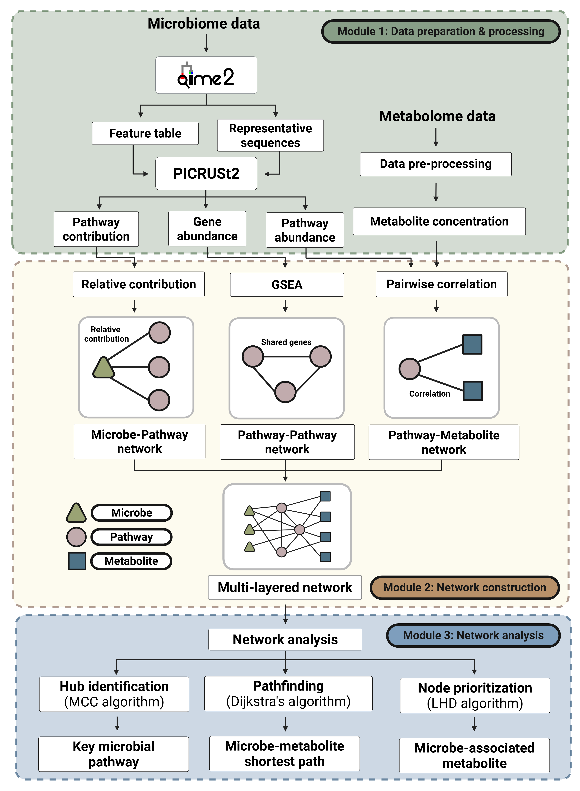
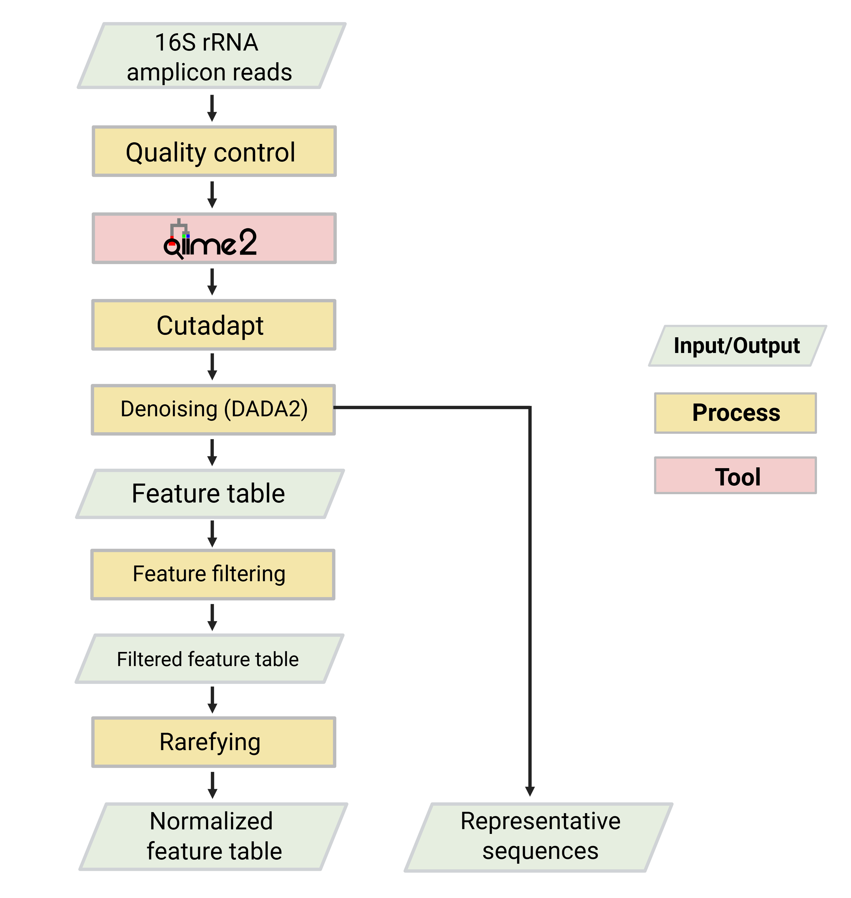
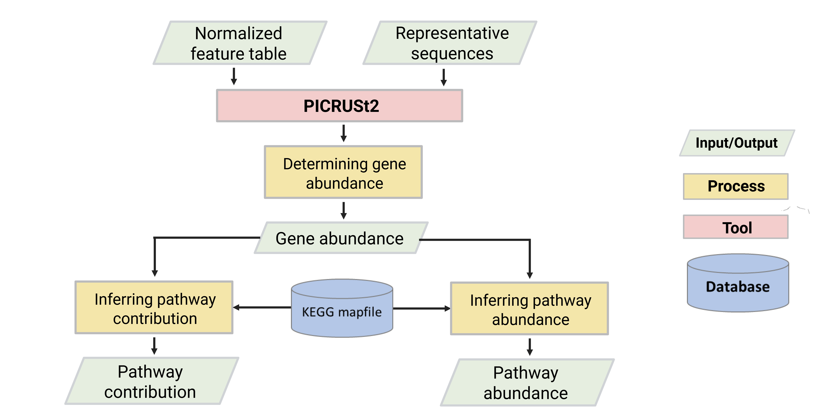

# NUIM: Network-based utility for integrating microbiome and metabolome data

We developed NUIM, a modular, network-based framework for integrating microbiome and metabolome data systematically. NUIM consists of three modules: (1) data preparation and processing, (2) network construction, and (3) network analysis.

<p align="center">
  
</p>

## Module 1: Data preparation and processing

This module defines the procedures required to prepare and process the input data for downstream network construction.

- Input data includes `microbial sequencing reads in FASTQ format` and `metabolite concentration table`.  
- Microbiome data processing involves the use of QIIME2 to generate a feature table and representative sequences. These outputs are subsequently processed using PICRUSt2 for functional prediction, yielding gene abundance, pathway abundance, and pathway contribution data.  
- Although metabolome data processing may vary depending on user preference and experimental design, NUIM assumes that metabolite concentrations have been appropriately processed by standard practice. For example, users may employ established platforms such as [Metabox](https://academic.oup.com/gigascience/article/doi/10.1093/gigascience/giae005/7629842) or [MetaboAnalyst](https://academic.oup.com/nar/article/52/W1/W398/7642060) to perform metabolomics data processing.

### <ins>QIIME2 workflow</ins>

This section provides a general QIIME2 workflow for processing paired-end 16S rRNA sequencing data. The goal is to generate a feature table and representative sequences for PICRUSt2.

#### **Required inputs**

| File            | Description                         |
|-----------------|-----------------------------------|
| `FASTQ`         | Raw paired-end sequencing reads   |
| `manifest.tsv`  | Mapping of sample IDs to FASTQ files |  

<p align="center">
  
</p>

```bash
# Activate QIIME2 environment
conda activate qiime2

# STEP 1: Import paired-end FASTQ files using a manifest file
# The manifest CSV should map sample IDs to file paths of forward and reverse reads.

qiime tools import \
  --type 'SampleData[PairedEndSequencesWithQuality]' \
  --input-path manifest.csv \
  --input-format PairedEndFastqManifestPhred33 \
  --output-path demux_reads.qza

# STEP 2: Trim primers/adapters
# Replace the primer sequences below with the ones used in your sequencing protocol.

qiime cutadapt trim-paired \
  --i-demultiplexed-sequences demux_reads.qza \
  --p-front-f <forward_primer_sequence> \
  --p-front-r <reverse_primer_sequence> \
  --o-trimmed-sequences trimmed_reads.qza

# STEP 3: Summarize read quality
# Review this visualization to determine appropriate truncation lengths for the next step.

qiime demux summarize \
  --i-data trimmed_reads.qza \
  --o-visualization quality_summary.qzv

# STEP 4: Denoise reads using DADA2
# Use the quality summary from Step 3 to choose truncation lengths and other parameters.

qiime dada2 denoise-paired \
  --i-demultiplexed-seqs trimmed_reads.qza \
  --p-trunc-len-f <truncation_length_forward> \
  --p-trunc-len-r <truncation_length_reverse> \
  --o-table feature_table.qza \
  --o-representative-sequences rep_seqs.qza \
  --o-denoising-stats denoising_stats.qza

# STEP 5: Filter low-abundance features
# Adjust minimum sample count and read frequency as appropriate for your dataset.

qiime feature-table filter-features \
  --i-table feature_table.qza \
  --p-min-samples <minimum_number_of_samples> \
  --p-min-frequency <minimum_total_frequency> \
  --o-filtered-table filtered_table.qza

# STEP 6: Rarefy the table to a uniform sequencing depth
# Use rarefaction curves to help select the sampling depth.

qiime feature-table rarefy \
  --i-table filtered_table.qza \
  --p-sampling-depth <depth_to_rarefy> \
  --o-rarefied-table normalized_table.qza

# STEP 7: Taxonomic classification
# Use a pre-trained classifier appropriate for your 16S region (e.g., SILVA, Greengenes).

qiime feature-classifier classify-sklearn \
  --i-classifier <pretrained_classifier.qza> \
  --i-reads filtered_rep_seqs.qza \
  --o-classification taxonomy.qza

# STEP 8: Export data for PICRUSt2
# Export the final feature table and representative sequences for functional prediction.

qiime tools export \
  --input-path normalized_table.qza \
  --output-path feature-table

qiime tools export \
  --input-path rep_seqs.qza \
  --output-path rep_seqs

qiime tools export \
  --input-path taxonomy.qza \
  --output-path taxonomy
```

#### **QIIME2 outputs**

| File                | Description                      |
|---------------------|---------------------------------|
| `feature-table.biom` | Feature (ASV) count table        |
| `rep_seqs.fasta`    | Representative sequences         |
| `taxonomy.tsv`      | Taxonomic assignment of ASVs | 

### <ins>PICRUSt2 workflow</ins>

PICRUSt2 predicts functional profiles from 16S rRNA data. This step uses a feature table and representative sequences from QIIME2.

#### **Required inputs**

| File                | Description                     |
|---------------------|---------------------------------|
| `feature-table.biom` | Feature table exported from QIIME2 (`normalized_table.qza`) |
| `rep_seqs.fasta`    | Representative sequences exported from QIIME2 (`rep_seqs.qza`) |

<p align="center">
  
</p>

```bash
# Activate PICRUSt2 environment
conda activate picrust2

# Run PICRUSt2 pipeline (no NSTI filtering)
picrust2_pipeline.py \
  -s rep_seqs.fasta \
  -i feature-table.biom \
  -o picrust2_out_nsti_default

# Optional: Add --max_nsti to filter low-confidence ASVs
# e.g., --max_nsti 0.5

# Infer pathway abundance and pathway contribution
# Users can choose to use either KEGG or MetaCyc pathways

# Generate pathway abundance data (sample × pathway)
pathway_pipeline.py \
  -i picrust2_out/<function_output_folder>/pred_metagenome_unstrat.tsv.gz \
  -o pathways_abundance \
  --no_regroup \
  --map <pathway_mapping_file.tsv>

# Generate pathway contribution data (ASV × pathway)
pathway_pipeline.py \
  -i picrust2_out/<function_output_folder>/pred_metagenome_unstrat.tsv.gz \
  -o pathways_contrib \
  --per_sequence_contrib \
  --per_sequence_abun picrust2_out/<function_output_folder>/seqtab_norm.tsv.gz \
  --per_sequence_function <predicted_functions.tsv.gz> \
  --no_regroup \
  --map <pathway_mapping_file.tsv>

# Gene abundance data (KEGG Orthologs) output by PICRUSt2:
# Located in: KO_metagenome_out/pred_metagenome_unstrat.tsv.gz
# This file contains predicted gene family (KO) abundances per sample.
```

#### **PICRUSt2 outputs**

| File                      | Description                            |
|---------------------------|--------------------------------------|
| `pred_metagenome_unstrat.tsv` | Predicted gene (KO) abundance        |
| `path_abun_unstrat.tsv`   | Predicted pathway abundance |
| `path_abun_contrib.tsv`   | Predicted pathway contribution |

## Module 2: Network construction

This module constructs a tripartite network linking microbial taxa, functional pathways, and metabolites. Follow the steps below to construct each network layer using the provided R functions:

### <ins>Step 1: Microbe–pathway network construction</ins>

The microbe–pathway network is constructed from pathway contribution data, with edges representing the relative contribution of each microbe to specific pathways.

#### **Required inputs**

| File | Description |
|---|---|
| `path_abun_contrib.csv` | Pathway contribution data from PICRUSt2. **Required columns**: `SampleID`, `FeatureID`, `FunctionID`, `taxon_function_abun`. |
| `sample_metadata.csv` | Sample metadata. **Required for group-specific analysis**; must contain `SampleID` and `class` columns. If not provided or `class` column is missing, data will be processed as one 'overall' group. |
| `taxa_name.csv` | Taxonomy annotations mapping `FeatureID` to taxonomic name (`TaxonID`). **Required columns**: `FeatureID`, `TaxonID`. |

```r
library(dplyr)

construct_microbe_pathway_network <- function(
  contrib_file,
  metadata_file = NULL, # Made optional
  taxonomy_file,
  output_file, # Now explicitly a directory path
  filtering = c("unfiltered", "mean", "median", "top10%", "top25%", "top50%", "top75%")
) {
  filtering <- match.arg(filtering)

  # Create output directory if it doesn't exist
  if (!dir.exists(output_file)) {
    dir.create(output_file, recursive = TRUE)
  }

  contrib <- read.csv(contrib_file)
  taxonomy <- read.csv(taxonomy_file)

  # Initial merge with taxonomy data
  merged_data <- merge(contrib, taxonomy, by = "FeatureID", all.x = TRUE)

  # Determine if grouping is needed
  process_by_group <- FALSE
  groups <- "overall" # Default group name if no grouping

  if (!is.null(metadata_file) && file.exists(metadata_file)) {
    metadata <- read.csv(metadata_file)
    
    if (!"SampleID" %in% colnames(metadata)) {
      stop("The 'sample_metadata.csv' file must contain a 'SampleID' column.")
    }
    
    if ("class" %in% colnames(metadata)) {
      # Merge with metadata if 'class' column exists for grouping
      merged_data <- merge(merged_data, metadata, by = "SampleID")
      groups <- unique(metadata$class)
      process_by_group <- TRUE
      message(paste("Processing data by group(s):", paste(groups, collapse = ", ")))
    } else {
      message("No 'class' column found in metadata. Processing overall data.")
    }
  } else {
    message("No metadata file provided or file not found. Processing overall data.")
  }

  # Loop through each group or process overall data
  for (current_group in groups) {
    if (process_by_group) {
      group_data <- merged_data %>% filter(class == current_group)
      group_suffix <- paste0("_", current_group)
    } else {
      group_data <- merged_data
      group_suffix <- "_overall"
    }

    # Calculate total abundance per taxon-function pair within the current group/overall
    taxon_function_total <- aggregate(
      taxon_function_abun ~ FunctionID + TaxonID,
      data = group_data,
      FUN = sum,
      na.rm = TRUE
    )

    # Calculate total abundance per function across all taxa in the current group/overall
    function_total <- aggregate(
      taxon_function_abun ~ FunctionID,
      data = taxon_function_total,
      FUN = sum,
      na.rm = TRUE
    )
    colnames(function_total)[2] <- "total_abundance_all_taxa"

    # Merge to calculate relative contribution
    taxon_function_total <- merge(taxon_function_total, function_total, by = "FunctionID")
    taxon_function_total$relative_contribution <- taxon_function_total$taxon_function_abun / taxon_function_total$total_abundance_all_taxa

    # Apply filtering based on user choice
    if (filtering != "unfiltered") {
      if (filtering %in% c("mean", "median")) {
        threshold_df <- aggregate(
          relative_contribution ~ FunctionID,
          data = taxon_function_total,
          FUN = ifelse(filtering == "mean", mean, median),
          na.rm = TRUE
        )
        colnames(threshold_df)[2] <- "threshold"
        taxon_function_total <- merge(taxon_function_total, threshold_df, by = "FunctionID")
        taxon_function_total <- subset(taxon_function_total, relative_contribution >= threshold | is.na(threshold))

      } else if (filtering %in% c("top10%", "top25%", "top50%", "top75%")) {
        percent_map <- c("top10%"=0.10, "top25%"=0.25, "top50%"=0.50, "top75%"=0.75)
        top_percent <- percent_map[filtering]

        taxon_function_total <- taxon_function_total %>%
          group_by(FunctionID) %>%
          arrange(desc(relative_contribution)) %>%
          mutate(
            rank = row_number(),
            n_taxa = n(),
            cutoff = pmax(ceiling(top_percent * n_taxa), 1)
          ) %>%
          filter(rank <= cutoff) %>%
          ungroup() %>%
          select(-rank, -n_taxa, -cutoff)
      }
    }

    # Order the results
    taxon_function_total <- taxon_function_total[order(taxon_function_total$FunctionID, -taxon_function_total$relative_contribution), ]

    # Construct output file path for the current group/overall
    output_path <- file.path(output_file, paste0("microbe_pathway_network", group_suffix, ".csv"))
    write.csv(taxon_function_total, output_path, row.names = FALSE)
    message(paste("Output saved to:", output_path))
  }
}

# Example usage:
construct_microbe_pathway_network(
  contrib_file = "path_abun_contrib.csv",      # Pathway contribution data file
  metadata_file = "sample_metadata.csv",       # Sample metadata (required for grouping)
  taxonomy_file = "taxa_name.csv",             # Taxonomy info per microbial feature
  output_file = "microbe_pathway_network_results",     # Output directory for results
  filtering = "median"
)
```

#### **Example output**

The output `microbe_pathway_network.csv` is a network table showing which microbes (taxa) contribute to which pathways, along with their contribution values.

| FunctionID | TaxonID | total_abundance | total_abundance_all_taxa | relative_contribution | median_contribution |
|------------|---------|------------------|----------------------------|------------------------|----------------------|
| ko00365    | g__Bilophila | 44.5 | 44.5 | 1.0 | 1.0 |
| ko00571    | g__Bifidobacterium | 1073.7 | 1076.3 | 0.998 | 0.5 |
| ko00720    | g__Blautia | 14084.3 | 16493.0 | 0.854 | 0.0055 |

Each row represents a weighted edge linking a microbial taxon (`TaxonID`) to a functional pathway (`FunctionID`) with the strength of the edge defined by the `relative_contribution`.
- `total_abundance`: The absolute contribution of a given taxon to a pathway summed across all samples.  
- `total_abundance_all_taxa`: The total combined contribution of all taxa to the same pathway, used as a baseline for normalization.
- `median_contribution` (and other thresholds like mean or top%) are shown in the table to indicate the filtering cutoff used for each pathway. This helps explain which taxa passed the filtering based on their relative contribution.

### <ins>Step 2: Pathway–pathway network construction</ins>

The pathway–pathway network is constructed using pathways identified as significant through Gene Set Enrichment Analysis (GSEA). Edges between pathways are defined based on shared genes, and Jaccard indices represent edge weights.

#### **Required inputs**

| File | Description |
|---|---|
| `pred_metagenome_unstrat.csv` | Gene abundance data from PICRUSt2. |
| `sample_metadata.csv` | Sample metadata with group or condition information. **Required columns**: `SampleID`, `class`. |
| `pathway_gene_map.csv` | Mapping file from pathways to genes. **First column:** pathway ID; **other columns:** gene IDs. |

```r
library(DESeq2)
library(clusterProfiler)
library(dplyr)
library(tidyr)
set.seed(123) # Set seed for reproducibility

construct_pathway_pathway_network <- function(
  abundance_file,
  metadata_file,
  map_file, 
  output_file,
  pvalueCutoff, 
  pAdjustMethod = c("fdr", "holm", "hochberg", "hommel", "bonferroni", "BH", "BY", "none")
) {
  # Validate pAdjustMethod input
  pAdjustMethod <- match.arg(pAdjustMethod)

  # Create output directory if it doesn't exist
  if (!dir.exists(output_file)) {
    dir.create(output_file, recursive = TRUE)
  }

  # 1. Load abundance data from provided file (now reads CSV)
  gene_abundance <- read.csv(abundance_file, header = TRUE, row.names = 1)
  
  # 2. Load sample metadata (now reads CSV)
  metadata <- read.csv(metadata_file, header = TRUE)
  
  # Ensure the correct SampleID and class columns are present
  if (!"SampleID" %in% colnames(metadata)) {
    stop("The 'sample_metadata.csv' file must contain a 'SampleID' column.")
  }
  if (!"class" %in% colnames(metadata)) {
    stop("The 'sample_metadata.csv' file must contain a 'class' column for group definition.")
  }
  
  # 3. Filter metadata samples present in abundance data
  # Use 'SampleID' for filtering and setting row names
  sample_ids <- colnames(gene_abundance)
  metadata <- metadata %>% filter(SampleID %in% sample_ids)
  
  # 4. Set 'condition' factor from 'class' column
  metadata$condition <- as.factor(metadata$class)
  rownames(metadata) <- metadata$SampleID # Use SampleID for row names
  
  # 5. Round abundance counts for DESeq2 compatibility
  gene_abundance_rounded <- round(gene_abundance)
  
  # Ensure sample order matches between countData and colData
  gene_abundance_rounded <- gene_abundance_rounded[, rownames(metadata)]

  # 6. Create DESeq2 dataset and run differential expression analysis
  dds <- DESeqDataSetFromMatrix(countData = gene_abundance_rounded,
                                colData = metadata,
                                design = ~ condition)
  dds <- DESeq(dds)
  
  # 7. Get all pairwise condition comparisons
  conditions <- levels(metadata$condition)
  comparisons <- combn(conditions, 2, simplify = FALSE)
  
  # 8. Load pathway-to-gene mapping and reshape into TERM2GENE format (now reads CSV)
  # The input file format is: V1 (pathway_id) V2 (gene_id1) V3 (gene_id2) ...
  # This is the direct format for TERM2GENE where TERM is V1 and GENE are others.
  map_raw <- read.csv(map_file, header = FALSE, fill = TRUE, stringsAsFactors = FALSE, skip = 1)
  
  TERM2GENE <- map_raw %>%
    gather(key = "temp_col", value = "gene", -V1) %>% # V1 becomes 'term', others become 'gene'
    select(term = V1, gene) %>%
    filter(gene != "") %>% # Remove empty gene entries
    distinct() # Ensure unique pathway-gene pairs
  
  gsea_results_list <- list()
  
  # 9. Loop over each pairwise comparison to run GSEA
  for (comp in comparisons) {
    cond1 <- comp[1]
    cond2 <- comp[2]
    
    # Get DESeq2 results for contrast cond2 vs cond1
    res <- results(dds, contrast = c("condition", cond2, cond1))
    
    # Prepare ranked gene list: sign(log2FoldChange) * -log10(pvalue)
    ranked_df <- as.data.frame(res[, c("log2FoldChange", "pvalue")])
    ranked_df <- ranked_df[!is.na(ranked_df$log2FoldChange) & !is.na(ranked_df$pvalue), ]
    ranked_df$rank <- sign(ranked_df$log2FoldChange) * -log10(ranked_df$pvalue)
    ranked_df <- ranked_df[order(ranked_df$rank, decreasing = TRUE), ]
    geneList <- setNames(ranked_df$rank, rownames(ranked_df))
    
    # Run GSEA using clusterProfiler
    gsea_res <- GSEA(geneList = geneList,
                     TERM2GENE = TERM2GENE,
                     pvalueCutoff = pvalueCutoff,
                     pAdjustMethod = pAdjustMethod,
                     seed = TRUE,
                     verbose = FALSE)
    
    # Save GSEA results dataframe
    gsea_df <- as.data.frame(gsea_res)
    key <- paste0(cond1, "_vs_", cond2)
    gsea_results_list[[key]] <- gsea_df
    
    # Construct full output path for GSEA results
    gsea_output_path <- file.path(output_file, paste0("gsea_results_", key, ".csv"))
    write.csv(gsea_df, gsea_output_path, row.names = FALSE)
  }
  
  # 10. Compute Jaccard indices between pathways within each comparison's GSEA results
  jaccard_results_list <- list()
  
  for (key in names(gsea_results_list)) {
    gsea_df <- gsea_results_list[[key]]
    gene_sets <- strsplit(as.character(gsea_df$core_enrichment), "/")
    gene_sets <- lapply(gene_sets, function(x) unique(na.omit(x)))
    
    n <- length(gene_sets)
    res_list <- list()
    
    if (n < 2) { # Ensure there are at least two pathways to compare
      message(paste("Less than two significant pathways for comparison:", key, ". Skipping Jaccard index calculation."))
      next
    }

    for (i in 1:(n-1)) {
      for (j in (i+1):n) {
        genes_i <- gene_sets[[i]]
        genes_j <- gene_sets[[j]]
        intersection <- length(intersect(genes_i, genes_j))
        union <- length(union(genes_i, genes_j))
        jaccard <- ifelse(union == 0, 0, intersection / union)
        
        if (jaccard > 0) {
          res_list[[length(res_list) + 1]] <- data.frame(
            pathway_1 = gsea_df$ID[i],
            pathway_2 = gsea_df$ID[j],
            jaccard_index = jaccard,
            comparison = key,
            stringsAsFactors = FALSE
          )
        }
      }
    }
    
    jaccard_df <- do.call(rbind, res_list)
    # Construct full output path for Jaccard results
    jaccard_output_path <- file.path(output_file, paste0("pathway_jaccard_", key, ".csv"))
    write.csv(jaccard_df, jaccard_output_path, row.names = FALSE)
    jaccard_results_list[[key]] <- jaccard_df
  }
  
  # Return GSEA and Jaccard results for further use
  return(list(gsea = gsea_results_list, jaccard = jaccard_results_list))
}

# Example usage:
construct_pathway_pathway_network(
   abundance_file = "pred_metagenome_unstrat.csv", 
   metadata_file = "sample_metadata.csv",          
   map_file = "pathway_gene_map.csv",              
   output_file = "pathway_network_results", # Path to the output directory that will contain results for each comparison        
   pvalueCutoff = 0.05, # User MUST specify this value, e.g., 0.05
   pAdjustMethod = "BH" # User can choose from "holm", "hochberg", "hommel", "bonferroni", "BH", "BY", "fdr", "none"
)
```
#### **Example output**

The function creates an output directory (e.g., `pathway_network_results`) containing `.csv` files for each pairwise group comparison (e.g., `G1_vs_G2`).

For each comparison, two types of files are generated:

1.  **`gsea_results_[group1]_vs_[group2].csv`**: Contains detailed Gene Set Enrichment Analysis (GSEA) results for pathways. Each row describes an enriched pathway, including its ID, description, enrichment score (NES), and adjusted p-value (`p.adjust`). The `core_enrichment` column lists the key genes driving the enrichment.

2.  **`pathway_jaccard_[group1]_vs_[group2].csv`**: Quantifies the similarity between *significant* pathways based on shared "core enriched" genes using the Jaccard index. This table defines the edges of the pathway-pathway network.

**Example table: `pathway_jaccard_G1_vs_G2.csv`**

| pathway_1 | pathway_2 | jaccard_index | comparison |
|:----------|:----------|:--------------|:-----------|
| ko00500   | ko00230   | 0.02173913    | G1_vs_G2   |
| ko00500   | ko00030   | 0.035714286   | G1_vs_G2   |
| ko00500   | ko00052   | 0.083333333   | G1_vs_G2   |
| ko00550   | ko00470   | 0.064516129   | G1_vs_G2   |

Each row represents a connection between two pathways (`pathway_1`, `pathway_2`). The `jaccard_index` (0-1) indicates the degree of shared genes between them; a higher value means more overlap and a stronger functional relationship. 

### <ins>Pathway–metabolite network construction</ins>

The pathway–metabolite network is constructed by calculating pairwise correlation (e.g., Spearman or Pearson) between pathway abundance and metabolite concentrations.  


### <ins>Multi-layered network</ins>

## Module 3: Network Analysis

This module provides three network analyses designed to identify context-specific associations:

- The hub identification uses the Maximal Clique Centrality (MCC) algorithm to identify key microbial pathways.  
- The pathfinding uses the Dijkstra's algorithm to identify the shortest path between the selected source and target nodes.  
- The node prioritization uses the Laplacian Heat Diffusion (LHD) algorithm to identify microbe-associated metabolites.
